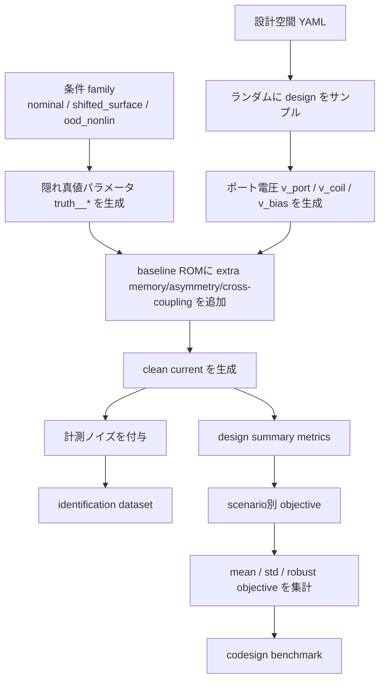

# plasma_codesign 手法・コード・ベンチマーク解説

> 本文書は、`plasma_codesign` と `plasma_codesign_bench2` に含まれるコード、およびそれを用いて生成した擬似ベンチマークの内容を、第三者が理解しやすい形で整理した技術解説です。  
> 対象は **低圧 CCP** と **ICP+Bias** で、目的は **所望の電極電圧波形を成立させる回路を、素子値・トポロジ・寄生配置まで含めて設計すること**です。

---

## 0. エグゼクティブサマリー

本コードの中心アイデアは、低圧プラズマを

- **単なる時変インピーダンス $Z(t)$ の再生対象**
- **単なる静的な RLC 等価回路**

としてではなく、**状態を持つ差動ポート ROM (reduced-order model)** として表すことです。

すなわち、プラズマを

$$
i_k = F_k(v_k, x, \theta), \qquad
q_k = Q_k(v_k, x, \theta), \qquad
\dot{x} = G(x, v, \theta)
$$

で表し、回路側は `ngspice` で高速に評価し、重いプラズマ計算や COMSOL/PIC/流体系は **ROM 構築と最終検証** に使う、という役割分担をとります。

この構成の利点は次の 5 つです。

1. **回路を変えたときにも自己無撞着に応答を更新**できる  
2. **自己バイアス・高調波・記憶効果**を持つ低圧プラズマに対応しやすい  
3. **素子値だけでなく、matching network のトポロジ、ケーブル長、return path** を最適化できる  
4. **ngspice** による高速探索と、**COMSOL / PIC / fluid** による高忠実度検証を分業できる  
5. **不確かさ込みのロバスト最適化**を最初から問題設定に入れられる

---

## 1. 問題の背景

### 1.1 なぜ難しいのか

低圧プラズマ装置の回路設計では、電源・matching network・ケーブル・feedthrough・return path・電極・チャンバー・プラズマが強く結びついています。  
特に CCP では **自己バイアス**、**シース由来の非線形性**、**高調波生成** が重要であり、ICP+Bias では **誘導ポート** と **バイアスポート** が同じプラズマ状態を介して結合します。

このため、次のような単純化は不十分になりやすいです。

- 「プラズマは一定のインピーダンス」
- 「プラズマは既知の $Z(t)$ を返すだけ」
- 「回路は fixed topology で素子値だけ調整する」

### 1.2 本来解きたい設計問題

本コードが狙う設計問題は、概念的には次です。

$$
\min_{d \in \mathcal{D}} \; J(d)
$$

ただし設計変数 $d$ は単なる素子値ではなく、

$$
d = (\text{topology},\; \text{component values},\; \text{cable/feed/return parasitics},\; \text{operating conditions})
$$

を含みます。

さらにプラズマ側の不確かさ $\theta$ を考慮し、

$$
J_{\mathrm{robust}}(d)
=
\mathbb{E}_{\theta}[J(d,\theta)] + \lambda \, \mathrm{Std}_{\theta}[J(d,\theta)]
$$

を最小化する問題として扱います。  
本コードでは $\lambda = 0.35$ を採用しています。

---

## 2. 本コードの目的

### 2.1 研究目的

本コードの目的は、低圧 CCP / ICP+Bias に対して、

1. **プラズマを状態付き多端子ポートとして近似**
2. **ngspice を高速な装置回路評価器として利用**
3. **トポロジ・素子値・寄生配置を含む mixed optimization**
4. **将来 COMSOL に持ち込める可搬な構成**
5. **ロバスト設計と OOD 条件評価**

を実現することです。

### 2.2 実装上の狙い

コード上では、目的を次の 4 層に分けています。

| 層 | 役割 | 本コードでの実装 |
|---|---|---|
| ポート仕様 | 回路とプラズマの境界契約 | `ports/plasma_ports.yaml` |
| ROM 同定 | プラズマ時系列から reduced model を当てる | `scripts/fit_ccp_rom.py`, `scripts/fit_icp_bias_rom.py` |
| 回路評価 | ngspice deck をレンダして transient 計算 | `templates/*.cir.tmpl`, `models/*.inc` |
| 設計探索 | ランダム探索 + 局所摂動 + 不確かさ平均/分散評価 | `scripts/optimizer.py` |

---

## 3. 本手法の全体像

### 3.1 方法の要点

本手法は次の 4 ステップです。

1. 高忠実度プラズマシミュレーション、実験、または擬似真値から $v(t), i(t)$ を得る
2. その時系列から **状態付き port-ROM** を同定する
3. ROM を ngspice に埋め込み、回路設計変数を変えながら大量評価する
4. 上位候補だけを高忠実度モデルや COMSOL で再検証する

### 3.2 なぜ $Z(t)$ 再生では足りないのか

時変インピーダンスの単純再生は、設計変数を変えた瞬間に境界条件が崩れます。  
たとえばケーブル長、matching network、block capacitor を変えると、ポート電圧そのものが変わるため、もともと与えた $Z(t)$ はその新しい動作点に対して自己無撞着ではありません。

そのため、本手法では **インピーダンスそのものではなく、ポート法則** を同定します。

$$
i(t) = i_{\mathrm{cond}}(v,x,\theta) + \frac{d}{dt}Q(v,x,\theta)
$$

この形にすると、回路から与えられた新しい $v(t)$ に対して、内部状態 $x(t)$ を更新しながら応答できます。

---

## 4. 本手法の詳細

## 4.1 共通ポートモデル

本コード全体の共通骨格は次です。

$$
i_k = F_k(v_k, x, \theta)
$$

$$
q_k = Q_k(v_k, x, \theta)
$$

$$
\dot{x} = G(x, v, \theta)
$$

ここで

- $k$ : ポート番号
- $v_k$ : ポート電圧
- $i_k$ : ポート電流
- $q_k$ : 電荷状態
- $x$ : 共有内部状態（密度・加熱・シース状態の proxy）
- $\theta$ : ガス条件、壁条件、表面係数、不確かさなど

です。

`ports/plasma_ports.yaml` では、全ポートで **plus node → minus node にプラズマへ流れ込む電流を正** と定義しています。  
この符号系は `ngspice` の 0 V 測定源 `VMEAS_*` と整合しており、将来 COMSOL の差動 External coupling へ移す時にも扱いやすい構成です。

---

## 4.2 CCP 1 ポート ROM

### 4.2.1 同定用の port-level モデル

`fit_ccp_rom.py` のベースモデルは次です。

**内部状態**
$$
\dot{d} = \alpha \frac{|v|}{V_s} - \frac{d}{\tau}
$$

**電荷**
$$
Q(v,d) = C_0 (1 + 0.1|d|) v + C_{nl} V_s \arctan\left(\frac{v}{V_s}\right)
$$

**電流**
$$
i(v,d) = G_0 (1 + K_d |d|) \tanh\left(\frac{v}{V_s}\right) + \frac{dQ}{dt}
$$

ここで

- $d$ : 密度/電離度の遅い proxy
- $G_0$ : 基本導電成分
- $K_d$ : 状態依存導電強化
- $C_0$ : 線形シース容量相当
- $C_{nl}$ : 非線形容量成分
- $V_s$ : 電圧スケール
- $\alpha, \tau$ : 状態励起と緩和

です。

### 4.2.2 ngspice の fallback ROM

`models/plasma_ccp_rom_fallback.inc` では、これを二つのシースと内部バルクに分けて実装しています。

**状態ノード $D$**
$$
C_{\mathrm{state}} \frac{dV_D}{dt} + \frac{V_D}{R_{\mathrm{state}}} = \alpha \frac{|V(P,N)|}{V_s}
$$

**バルク伝導**
$$
i_{\mathrm{bulk}} = G_0 (1 + K_d |V_D|) \tanh\left(\frac{V(B,N)}{V_s}\right)
$$

**powered sheath**
$$
Q_p = C_{sp,0}(1+0.1|V_D|)V_{PB} + C_{sp,nl}V_s\arctan\left(\frac{V_{PB}}{V_s}\right)
$$

**grounded sheath**
$$
Q_g = C_{sg,0}(1+0.1|V_D|)V_{BN} + C_{sg,nl}V_s\arctan\left(\frac{V_{BN}}{V_s}\right)
$$

重要なのは、**導電電流 + 電荷微分** の形を保っていることです。  
これは単なる可変容量よりも、低圧シースの波形依存性を回路と自然に結びつけやすい形です。

---

## 4.3 ICP+Bias 2 ポート ROM

### 4.3.1 port-level モデル

`fit_icp_bias_rom.py` のモデルは、coil port と bias port が **1 つの共有内部状態 $d$** を持つ 2 ポートモデルです。

**コイル側のインダクタ電流**
$$
\dot{i}_L = \frac{v_{\mathrm{coil}}}{L_{\mathrm{coil,0}}}
$$

**共有状態**
$$
\dot{d} =
K_{\mathrm{coil}} |i_{\mathrm{coil}}|
+
K_{\mathrm{bias}} \frac{|v_{\mathrm{bias}}|}{V_s}
-
\frac{d}{\tau}
$$

**コイル電流**
$$
i_{\mathrm{coil}} = i_L + (G_{\mathrm{coil,0}} + K_{g,\mathrm{coil}} |d|) v_{\mathrm{coil}}
$$

**バイアス側電荷**
$$
Q_{\mathrm{bias}} =
C_{\mathrm{bias,0}}(1+0.1|d|)v_{\mathrm{bias}}
+
C_{\mathrm{bias,nl}}V_s\arctan\left(\frac{v_{\mathrm{bias}}}{V_s}\right)
$$

**バイアス電流**
$$
i_{\mathrm{bias}} =
G_{\mathrm{bias,0}}(1+K_{g,\mathrm{bias}}|d|)
\tanh\left(\frac{v_{\mathrm{bias}}}{V_s}\right)
+
\frac{dQ_{\mathrm{bias}}}{dt}
$$

### 4.3.2 物理的な意味

このモデルは、誘導加熱とバイアスシースが **同じプラズマ密度状態を共有する** という最低限の連成を持たせたものです。  
完全な電磁場/PIC モデルではありませんが、**coil の駆動を変えると bias port 応答も変わる** という、今回の設計問題にとって本質的な性質は保持しています。

---

## 4.4 回路側の実装

### 4.4.1 CCP deck の構成

`templates/hardware_full_ccp_ngspice.cir.tmpl` は概ね次の構成です。

1. 正弦 RF source
2. 50 Ω generator resistor
3. `L` または `PI` 型 matching network
4. cable の lumped $RLC$
5. block capacitor
6. return path の $RL$
7. 0 V 測定源 `VMEAS_CCP`
8. `PLASMA_CCP` サブ回路
9. 数値安定化抵抗 `R_STAB`, `R_BLEED`

### 4.4.2 ICP+Bias deck の構成

`templates/hardware_full_icp_bias_ngspice.cir.tmpl` は次を持ちます。

- coil 側 source + generator + matching + feed parasitic + measurement source
- bias 側 source (DC + AC) + generator + matching + feed parasitic + block capacitor + measurement source
- 2 ポート `PLASMA_ICP_BIAS`
- 安定化抵抗と bleed 抵抗

### 4.4.3 数値上の工夫

テンプレートでは `ngspice` の transient 安定化のために

```spice
.option method=gear maxord=2 reltol=1e-4 abstol=1e-10 chgtol=1e-15
```

を指定しています。  
また、プラズマポート近傍に高抵抗の bleed と stabilizer を置き、理想源と理想的な外部要素が直結して DAE 的に不安定になるのを避けています。

---

## 4.5 設計目的関数

### 4.5.1 ケースごとの目的関数

CCP では `scripts/common.py` の `evaluate_ccp_objective()` が次を計算します。

$$
J_{\mathrm{ccp}} =
w_v \, \mathrm{RMSE}(v_{\mathrm{port}}, v_{\mathrm{target}})
+
w_i \, \phi(I_{\mathrm{pk}})
+
w_p \, \frac{|P_{\mathrm{avg}}|}{100}
+
w_{\mathrm{sb}} \, \frac{|\bar{v} - V_{\mathrm{sb}}^*|}{100}
$$

ここで

$$
P_{\mathrm{avg}} = \frac{1}{T} \int_0^T v(t)i(t)\,dt,
\qquad
\bar{v} = \frac{1}{T} \int_0^T v(t)\,dt
$$

です。

ピーク電流ペナルティは

$$
r = \frac{I_{\mathrm{pk}}}{I_{\mathrm{pk}}^{\max}}
$$

$$
\phi(I_{\mathrm{pk}})=
\begin{cases}
0.05 r & (r \le 1) \\
0.05 + (r-1)^2 & (r > 1)
\end{cases}
$$

としています。

ICP+Bias も同様ですが、RMSE は bias 電圧波形で評価し、平均電力は coil と bias の総和を使います。

### 4.5.2 ロバスト目的関数

各設計案 $d$ に対し、複数の不確かさシナリオ $\theta_s$ をサンプルし、

$$
J_{\mathrm{robust}}(d)
=
\frac{1}{S}\sum_{s=1}^S J(d,\theta_s)
+
\lambda \, \sqrt{\frac{1}{S} \sum_{s=1}^S \left(J(d,\theta_s) - \bar{J}\right)^2}
$$

を最小化します。  
本コードでは $\lambda = 0.35$、シナリオ数 $S=4$ です。

---

## 4.6 設計変数

### 4.6.1 CCP の設計空間

`configs/design_space_ccp.yaml` では以下を設計変数にしています。

| カテゴリ | 変数 |
|---|---|
| トポロジ | `topology`: L または PI |
| 電源 | `VAC_BIAS` |
| matching | `L_MATCH`, `C_MATCH_OUT`, `C_MATCH_IN` |
| ブロッキング | `C_BLOCK` |
| 寄生配置 | `CABLE_LEN_M`, `RETURN_LEN_M` |
| 固定パラメータ | 50 Ω generator, cable per-meter parasitics, return per-meter parasitics |

### 4.6.2 ICP+Bias の設計空間

`configs/design_space_icp_bias.yaml` では

| カテゴリ | 変数 |
|---|---|
| coil topology | `coil_topology`: L または PI |
| bias topology | `bias_topology`: L または PI |
| coil source | `VICP_AC` |
| bias source | `VBIAS_AC`, `VBIAS_DC` |
| coil matching | `L_COIL_MATCH`, `C_COIL_MATCH_OUT`, `C_COIL_MATCH_IN` |
| bias matching | `L_BIAS_MATCH`, `C_BIAS_MATCH_OUT`, `C_BIAS_MATCH_IN` |
| block cap | `C_BLOCK_BIAS` |
| 寄生配置 | `COIL_FEED_LEN_M`, `BIAS_FEED_LEN_M` |

---

## 5. ポート仕様

`ports/plasma_ports.yaml` に定義されるポートは次の通りです。

| ポート | モード | 回路 → プラズマ | プラズマ → 回路 | 目的 |
|---|---|---|---|---|
| `CCP_BIAS` | `time_domain` | `v_t` | `i_t` | CCP 1 ポート |
| `ICP_COIL` | `fundamental_complex` | `v1_complex`, `frequency_Hz` | `i1_complex` | 誘導側ポート |
| `BIAS_RFDC` | `time_domain` | `v_t` | `i_t` | 基板/電極バイアスポート |
| `CHAMBER_RETURN` | optional | `v_t` | `i_t` | return path 最適化時のみ追加 |

推奨観測量として、`q_sheath_*`, `p_abs_cycle`, `v_selfbias`, `i_harmonics`, `ion_flux_proxy`, `ion_energy_proxy` が含まれます。

---

## 6. コード構成と役割

| ファイル | 役割 | 入力 | 出力 |
|---|---|---|---|
| `ports/plasma_ports.yaml` | ポート契約定義 | ノード名・符号規約 | 共通 I/O 仕様 |
| `configs/design_space_ccp.yaml` | CCP 設計空間・目的関数・不確かさ | YAML | 最適化設定 |
| `configs/design_space_icp_bias.yaml` | ICP+Bias 設計空間・目的関数・不確かさ | YAML | 最適化設定 |
| `models/plasma_ccp_rom_fallback.inc` | ngspice 用 CCP ROM | `.param` | ポート電流応答 |
| `models/plasma_icp_bias_rom_fallback.inc` | ngspice 用 ICP+Bias ROM | `.param` | coil/bias 電流応答 |
| `templates/hardware_full_ccp_ngspice.cir.tmpl` | CCP ngspice deck テンプレート | design + uncertainty | `.cir` |
| `templates/hardware_full_icp_bias_ngspice.cir.tmpl` | ICP+Bias deck テンプレート | design + uncertainty | `.cir` |
| `scripts/fit_ccp_rom.py` | CCP ROM 同定 | `time,v_port,i_port` | fitted YAML |
| `scripts/fit_icp_bias_rom.py` | ICP+Bias ROM 同定 | `time,v_coil,i_coil,v_bias,i_bias` | fitted YAML |
| `scripts/optimizer.py` | mixed search + robust objective | config + ngspice | best design + history |
| `scripts/generate_benchmark_dataset.py` | 擬似ベンチマーク生成 | config + target + ROM | benchmark dataset |
| `scripts/evaluate_identification_baselines.py` | 同定 baseline 計算 | benchmark CSV | baseline summary |

---

## 7. 処理フロー

## 7.1 全体ワークフロー

```mermaid
flowchart TD
    A[高忠実度プラズマ計算 or 実験 or 擬似真値] --> B[ポート波形取得 v(t), i(t), q proxy, self-bias]
    B --> C[ROM同定 fit_ccp_rom / fit_icp_bias_rom]
    C --> D[ngspice ROMサブ回路生成]
    D --> E[回路テンプレートへ設計変数を埋め込む]
    E --> F[ngspice transient評価]
    F --> G[目的関数計算<br/>波形誤差・ピーク電流・平均電力・自己バイアス]
    G --> H[不確かさシナリオ平均 + 分散]
    H --> I[混合離散連続探索<br/>topology / values / parasitics]
    I --> J[上位候補]
    J --> K[高忠実度モデルで再評価]
    K --> L[必要に応じて COMSOL / PIC / 実験で検証]
```

## 7.2 ベンチマーク生成ワークフロー



---

## 8. 他の手法との比較

## 8.1 手法全体の比較表

| 手法 | カテゴリ | 中心アイデア | 長所 | 短所 | 今回の問題への適性 |
|---|---|---|---|---|---|
| 静的 RLC 等価回路 | 簡易回路モデル | プラズマを固定負荷で近似 | 実装が容易 | 回路変更時の自己無撞着性が弱い | 低い |
| 時変インピーダンス再生 $Z(t)$ | ナイーブ時系列モデル | 既知の応答を replay | 1 ケース再現は簡単 | 設計変数変更に追従しにくい | 低い |
| **状態付き差動ポート ROM + ngspice（本手法）** | **回路共設計** | $i(v,x), Q(v,x), \dot x$ を同定して埋め込む | 高速、自己無撞着性、トポロジ最適化可 | 空間分布は粗い、ROM 妥当域が必要 | **高い** |
| Xyce + General External | 強連成回路 | 外部デバイスで DAE を強連成 | 大規模 sweep、感度解析に強い | 実装が重く、Newton ごとの評価が必要 | 高いが重い |
| COMSOL Circuit + Plasma Module | 連成 multiphysics | 場・回路・幾何を一体で解く | 忠実度が高い、最終検証向き | 計算コストが高く最適化ループに不向き | 最終検証に非常に有用 |
| Global / 1D fluid + BOLSIG+ | 中忠実度プラズマ | 係数生成・parametric study | 速い、ROM 構築に向く | sheath / EM / kinetic 効果は限定的 | ROM 構築に有用 |
| PIC/MCC / PIC-DSMC | 高忠実度プラズマ | kinetic / sheath / IEDF を解く | 物理忠実度が高い | そのまま設計 loop に入れるには重い | 検証に有用 |
| Multi-frequency matching 単独設計 | 回路手法 | 高調波ごとの整合を重視 | waveform tailoring に有効 | プラズマ内部状態が無いと不十分 | 補助的に有用 |

### 本手法が優れる点

本手法は、**簡易法の速度**と**高忠実度法の自己無撞着性**の間を狙った方法です。  
特に次の点で有利です。

1. **設計変数を変えたときの閉ループ再計算**ができる  
2. **トポロジ・ケーブル・return path** まで設計変数化できる  
3. **ロバスト最適化**を自然に実装できる  
4. **COMSOL / PIC への橋渡し** がしやすい

---

## 8.2 カテゴリ別の比較と改善点

### A. プラズマ表現のカテゴリ

| カテゴリ | 内容説明 | 典型的な工夫 | 本コードの独自改善点 | 期待される効果 |
|---|---|---|---|---|
| 静的負荷モデル | 一定 RLC で近似 | 動作点ごとに再パラメータ化 | 採用しない | 計算は速いが今回の目的には不足 |
| 時変 $Z(t)$ モデル | 既知時系列を replay | 実測波形の再生 | 採用しない | 1 ケース再現はできるが最適化には弱い |
| **状態付き port-ROM** | $i(v,x), Q(v,x), \dot x$ で表現 | 遅い状態変数、非線形容量、導電項 | **charge-based 表現** と **共有状態** を採用 | 回路変更時も応答更新できる |
| Multi-port ROM | 複数ポートの相互作用を表現 | 相互結合項、共有状態 | **ICP_COIL と BIAS_RFDC の共有状態** | ICP+Bias の本質的な相互作用を保持 |
| Hidden truth 拡張 | baseline ROM にない効果を追加 | memory, asymmetry, stray | **ベンチマークでは意図的に model misspecification を導入** | 同定器の過学習を防ぎ、実用性を上げる |

### B. 連成・ソルバのカテゴリ

| カテゴリ | 内容説明 | 典型的な工夫 | 本コードの独自改善点 | 期待される効果 |
|---|---|---|---|---|
| ngspice 単独 | 回路 transient を高速に解く | behavioral source, Q-based C | **smooth surrogate + stabilization resistor + measurement source** | 最適化ループを高速に回せる |
| Xyce 外部連成 | 外部 DAE を強連成 | General External device | **将来拡張先として位置付け** | より大規模な連成に発展可能 |
| COMSOL 連成 | 場・回路・幾何を同時に解く | External I vs. U, SPICE import | **portable circuit と ROM を分離する設計思想** | 最終検証と幾何評価に向く |
| 高忠実度を内側に直接入れる | PDE/PIC を毎 trial 実行 | なし | **採用しない** | 最適化が現実的な時間で終わらない |

### C. 最適化のカテゴリ

| カテゴリ | 内容説明 | 典型的な工夫 | 本コードの独自改善点 | 期待される効果 |
|---|---|---|---|---|
| 手動チューニング | 技術者が逐次調整 | 経験則 | 採用しない | 再現性と汎用性が低い |
| 連続値のみ最適化 | 素子値のみ調整 | gradient / local search | `topology` を含める形へ拡張 | 設計自由度が増える |
| **混合離散連続最適化** | topology + 値 + 配置 | random + local search | **L/PI 選択 + 長さ寄生まで最適化** | 実機に近い設計空間を扱える |
| 単一シナリオ最適化 | nominal 条件だけ最適化 | deterministic search | **不確かさ 4 シナリオで mean + std を最小化** | 設計の頑健性が増す |

### D. 検証・ベンチマークのカテゴリ

| カテゴリ | 内容説明 | 典型的な工夫 | 本コードの独自改善点 | 期待される効果 |
|---|---|---|---|---|
| 単純 replay データ | 同定器に都合のよい生成 | ノイズなし | 採用しない | 実用性能を誤る |
| 第一原理 benchmark | PIC / 実験 benchmark | 公開条件、コード間比較 | 将来の外部 benchmark と接続予定 | 信頼性が高いが重い |
| **擬似 misspecified benchmark** | baseline モデルに hidden dynamics を追加 | OOD split, hidden truth | **memory / asymmetry / cross-coupling / noise / robust design** | 実践的な比較がしやすい |

---

## 9. 本手法が課題に対して有用な理由

| 課題 | ナイーブな方法の問題 | 本手法の対応 | 効果 |
|---|---|---|---|
| 回路変更でプラズマ応答が変わる | 固定 $Z(t)$ は追従しない | $i(v,x), Q(v,x), \dot x$ を使う | 自己無撞着な再計算 |
| 自己バイアス・高調波が重要 | 静的負荷では消える | charge-based 非線形モデルを使う | 波形とプロセス proxy を両立しやすい |
| ICP と bias の相互作用 | 独立モデルでは不十分 | 共有状態付き 2 ポート ROM | coil/bias の連動を保持 |
| 寄生配置を設計したい | 素子値だけでは表現不能 | cable/feed/return 長さを設計変数化 | 実装可能な設計へ近づく |
| 不確かさに強い設計が欲しい | nominal 最適化は脆い | mean + std の robust objective | シナリオ変動への耐性が向上 |
| COMSOL に移行したい | ngspice 専用実装は移植しにくい | 差動ポートと可搬 SPICE の思想を分離 | 後工程の整合がとりやすい |

---

## 10. ベンチマークの内容

## 10.1 何を評価するベンチマークか

`plasma_codesign_bench2` は、次の 4 タスクを評価するための擬似ベンチマークです。

1. **CCP identification**
2. **ICP+Bias identification**
3. **CCP robust codesign**
4. **ICP+Bias robust codesign**

重要なのは、単なる時系列回帰ではなく、

- **ROM 同定**
- **設計探索**
- **不確かさ下での頑健性**
- **OOD 条件での一般化**

を分けて評価できることです。

## 10.2 データセット規模

`benchmark/manifest.json` に基づく構成は次の通りです。

| タスク | 規模 | 備考 |
|---|---:|---|
| CCP identification | 96 cases | train/val/test_id/test_ood |
| ICP+Bias identification | 80 cases | train/val/test_id/test_ood |
| CCP codesign | 80 designs × 4 scenarios = 320 cases | robust objective 集計あり |
| ICP+Bias codesign | 64 designs × 4 scenarios = 256 cases | robust objective 集計あり |

分割は以下です。

| データ | train | val | test_id | test_ood |
|---|---:|---:|---:|---:|
| CCP identification | 60 | 12 | 12 | 12 |
| ICP+Bias identification | 48 | 12 | 10 | 10 |

## 10.3 ベンチマークの target 波形

`generate_targets.py` では次の target を使っています。

### CCP target
$$
v_{\mathrm{target}}^{\mathrm{CCP}}(t)
=
165\sin(\omega t + 0.08)
+
26\sin(2\omega t - 0.55)
-
14\sin(3\omega t + 0.22)
$$

その後、平均を引いて zero-mean 化します。

### Bias target
$$
v_{\mathrm{target}}^{\mathrm{bias}}(t)
=
-55
+
105\sin(\omega t + 0.12)
+
21\sin(2\omega t - 0.45)
-
8\sin(3\omega t + 0.10)
$$

つまり、**単純な正弦波追従ではなく、複数高調波を含む波形整形問題**として設計されています。

## 10.4 ベンチマークでの擬似真値生成

### 10.4.1 回路側の detuning と整合品質

CCP では設計変数から等価共振周波数を計算し、

$$
f_0 = \frac{1}{2\pi\sqrt{L_{\mathrm{match}} C_{\mathrm{eq}}}}
$$

$$
\Delta = \log\left(\frac{f_0}{f_{\mathrm{ideal}}}\right)
$$

を用いて整合度 proxy $q_{\mathrm{match}}$ を決めています。

概念的には

$$
q_{\mathrm{match}}
\approx
\mathrm{clip}
\left(
0.18 + 0.74 \, e^{-\frac{1}{2}(\Delta/\sigma)^2}
\cdot
\text{topology bonus}
\cdot
\text{block factor}
\cdot
\text{cable penalty}
\cdot
\text{return penalty},
0.05, 0.98
\right)
$$

です。

同様に ICP+Bias では coil と bias に対して $q_{\mathrm{coil}}$, $q_{\mathrm{bias}}$ を別々に作っています。  
このため、ベンチマークは **設計変数 → ポート波形 → プラズマ応答** の流れを持っています。

### 10.4.2 CCP hidden truth の追加項

CCP の擬似真値は baseline ROM に対し、さらに

- memory
- asymmetry
- emission-like current
- source stray coupling

を加えています。

状態は

$$
\dot{d} =
\beta_{\mathrm{mem}} \frac{|\dot{v}|}{\|\dot{v}\|_\infty}
+
\alpha \frac{|v|}{V_s}
-
\frac{d}{\tau}
$$

$$
\dot{s} =
0.9 a \tanh\left(\frac{v}{1.4V_s}\right)
-
\frac{s}{\tau_s}
$$

追加電荷は

$$
Q_{\mathrm{extra}}
=
c_{\mathrm{asym}} C_0 v s
+
0.08 C_0 V_s \tanh\left(\frac{v}{V_s}\right)
$$

追加電流は

$$
i_{\mathrm{extra}}
=
\frac{dQ_{\mathrm{extra}}}{dt}
+
g_{\mathrm{emiss}}
\frac{\max(v,0)^2}{V_s^2 + \max(v,0)^2 + 10^{-12}}
+
C_{\mathrm{stray}} \dot{v}_{\mathrm{src}}
$$

です。

### 10.4.3 ICP+Bias hidden truth の追加項

ICP+Bias では、shared state $d$ に加えて heating-like state $h$ を導入しています。

$$
\dot{d} =
K_{\mathrm{coil}} |i_{\mathrm{coil}}^{\mathrm{base}}|
+
K_{\mathrm{bias}} \frac{|v_{\mathrm{bias}}|}{V_s}
-
\frac{d}{\tau}
$$

$$
\dot{h} =
0.18\frac{(i_{\mathrm{coil}}^{\mathrm{base}})^2}{\|i_{\mathrm{coil}}^{\mathrm{base}}\|_\infty^2}
+
0.05\frac{|v_{\mathrm{bias}}|}{\|v_{\mathrm{bias}}\|_\infty}
-
\frac{h}{\tau_h}
$$

追加電荷は

$$
Q_{\mathrm{extra}}
=
a_{\mathrm{bias}} C_{\mathrm{bias,0}} v_{\mathrm{bias}}
\tanh\left(\frac{v_{\mathrm{bias}}}{V_s}\right)
+
0.05 C_{\mathrm{bias,0}} V_s h
$$

追加電流は

$$
i_{\mathrm{coil}} = i_{\mathrm{coil}}^{\mathrm{base}} + g_{\mathrm{coil,mem}} h v_{\mathrm{coil}}
$$

$$
i_{\mathrm{bias}} = i_{\mathrm{bias}}^{\mathrm{base}} + \frac{dQ_{\mathrm{extra}}}{dt} + C_x \frac{d i_{\mathrm{coil}}^{\mathrm{base}}}{dt}
$$

です。

### 10.4.4 重要な意味

この作り方により、ベンチマークは **baseline ROM をそのまま当てれば完全に解ける問題** にはなっていません。  
つまり、実際の研究でありがちな

- モデルミスマッチ
- 表面条件ずれ
- hidden dynamics
- OOD shift

を含んだ、より現実的な比較用データになっています。

---

## 10.5 ベンチマークの評価量

各ケースでは、単なる波形 RMSE だけでなく、次の proxy を出しています。

| 指標 | CCP | ICP+Bias |
|---|---|---|
| `v_rmse` | あり | bias 波形に対してあり |
| `i_peak` | あり | coil/bias の最大 |
| `avg_power` | $\langle vi \rangle$ | $\langle v_{\mathrm{coil}}i_{\mathrm{coil}} + v_{\mathrm{bias}}i_{\mathrm{bias}} \rangle$ |
| `selfbias` | $\overline{v_{\mathrm{port}}}$ | $\overline{v_{\mathrm{bias}}}$ |
| 高調波 | $V_1,V_2,V_3,I_1,I_2,I_3$ | bias と coil で別々 |
| `density_proxy` | あり | あり |
| `ion_flux_proxy` | あり | あり |
| `ion_energy_proxy` | あり | あり |

プロセス指標そのものではありませんが、**電極波形だけに偏らない評価** を行うための surrogate として有用です。

---

## 10.6 baseline 結果

`benchmark/baselines/baseline_summary.json` にある基準結果は次の通りです。

### CCP identification baseline

| split | NRMSE(meas) | NRMSE(clean) | cost |
|---|---:|---:|---:|
| train | 0.0538 | 0.0526 | 1.8160 |
| val | 0.1343 | 0.1338 | 14.5874 |
| test_id | 0.1187 | 0.1184 | 16.5697 |
| test_ood | 0.0627 | 0.0603 | 1.1328 |
| overall | 0.0731 | 0.0720 | 5.1713 |

### ICP+Bias identification baseline

| split | coil NRMSE(clean) | bias NRMSE(clean) | cost |
|---|---:|---:|---:|
| train | 0.0072 | 0.1129 | 3.8600 |
| val | 0.0070 | 0.1070 | 3.3176 |
| test_id | 0.0059 | 0.1167 | 4.1553 |
| test_ood | 0.0181 | 0.2480 | 19.6720 |
| overall | 0.0084 | 0.1294 | 5.7920 |

### 読み解き方

- CCP baseline は overall で clean NRMSE が **約 0.072**  
- ICP+Bias は coil 側がかなり容易で、overall clean NRMSE が **約 0.008**  
- 一方、bias 側は hidden nonlinearity / cross-coupling のため難しく、overall clean NRMSE が **約 0.129**  
- test_ood では特に bias 側が難化しており、OOD 一般化の評価に使いやすい

---

## 10.7 codesign ベンチマークの例

`ccp_design_aggregates.csv` と `icp_bias_design_aggregates.csv` から、最良 robust objective の例を挙げると次の通りです。

### CCP の best robust design 例

| 項目 | 値 |
|---|---:|
| design_id | ccp_design_002 |
| topology | L |
| `VAC_BIAS` | 160.583 |
| `L_MATCH` | 2.056e-07 |
| `C_MATCH_OUT` | 4.696e-10 |
| `C_MATCH_IN` | 2.628e-10 |
| `C_BLOCK` | 3.360e-09 |
| `CABLE_LEN_M` | 2.035 |
| `RETURN_LEN_M` | 0.447 |
| `mean_objective` | 16.131 |
| `std_objective` | 2.864 |
| `robust_objective` | 17.133 |

### ICP+Bias の best robust design 例

| 項目 | 値 |
|---|---:|
| design_id | icp_design_001 |
| `coil_topology` | PI |
| `bias_topology` | L |
| `VICP_AC` | 284.179 |
| `VBIAS_AC` | 109.017 |
| `VBIAS_DC` | -50.758 |
| `L_COIL_MATCH` | 2.373e-06 |
| `L_BIAS_MATCH` | 2.461e-06 |
| `COIL_FEED_LEN_M` | 3.066 |
| `BIAS_FEED_LEN_M` | 0.904 |
| `mean_objective` | 40.327 |
| `std_objective` | 3.738 |
| `robust_objective` | 41.635 |

この例からも、最適化対象が **素子値だけではなく、トポロジと feed/return の長さ** を含んでいることが分かります。

---

## 11. 他手法と比べた本手法の有用性

### 11.1 ngspice を使う意味

`ngspice` は

- behavioral source / resistor / capacitor
- `Q=` を使う charge-based capacitor
- XSPICE code model
- OpenVAF/OSDI による Verilog-A 読み込み
- shared-library API

を備えており、**ROM を回路素子として埋め込む** という今回の課題に向いています。  
一方で PSS は experimental で、強非線形・高調波豊富な系ではまず transient ベースで進めるのが安全です。

### 11.2 Xyce と比べた位置付け

Xyce はより強い外部連成や感度解析に向きますが、General External device は Newton 反復ごとに外部ベクトルを返す前提であり、内側に重い PDE をそのまま入れるには不向きです。  
今回の段階では、**軽い ROM + ngspice** の方が試行回数を稼げます。

### 11.3 COMSOL と比べた位置付け

COMSOL は最終検証に非常に有用ですが、matching network まで含む時間周期プラズマ・回路・場の同時最適化を大量 trial で回すのは高コストです。  
そのため、本手法は **「探索は ngspice、確認は COMSOL」** という役割分担を採ります。

### 11.4 PIC / fluid と比べた位置付け

PIC/MCC や fluid は物理的には強力ですが、そのまま最適化の内側に入れると重すぎます。  
本手法は、**これらを捨てるのではなく、ROM 構築と最終検証に位置付ける** ことで、実用的な設計 loop を実現します。

---

## 12. 第三者が理解するために重要なポイント

### 12.1 まず理解すべき 3 点

1. **プラズマを 1 個の時変インピーダンスと見なしていない**  
2. **回路側はトポロジ・値・寄生を最適化している**  
3. **benchmark は intentionally misspecified** であり、baseline と完全一致しない

### 12.2 このコードは何ではないか

- 第一原理 PIC コードではない
- 完全な COMSOL 連成モデルではない
- 実験データそのものではない
- 単なる波形回帰ベンチマークではない

### 12.3 このコードは何に向いているか

- 研究初期の設計空間探索
- ROM 同定手法の比較
- robust optimization の比較
- topology / parasitic-aware な設計の比較
- COMSOL や高忠実度モデルへつなぐ前段の整理

---

## 13. 限界と今後の改善

### 13.1 現状の限界

| 項目 | 内容 |
|---|---|
| 物理忠実度 | 擬似 benchmark は smooth surrogate ベースであり、第一原理ではない |
| 空間分布 | 現在の ROM は 0D/port ベースで、強い spatial nonuniformity を直接は表さない |
| EM 効果 | 大面積 VHF CCP や強い電磁モードは別扱いが必要 |
| 化学反応 | electronegative / reactive gas chemistry は未実装 |
| プロセス評価 | ion flux / energy は proxy であり、IEDF そのものではない |
| 最適化器 | random + local の最小実装であり、BoTorch / Optuna ほど洗練されていない |

### 13.2 改善の方向

1. `fit_*.py` をベイズ推定や系列モデルへ拡張  
2. `models/*.inc` を Verilog-A / XSPICE 実装へ昇格  
3. 設計探索を multi-fidelity Bayesian optimization へ変更  
4. Ar 系から reactive/electronegative 系へ拡張  
5. 上位候補を COMSOL / PIC / 実験で閉ループ同定

---

## 14. 実務・研究での使い分け指針

| フェーズ | 使うべき方法 |
|---|---|
| 研究初期の仮説探索 | 本コードの ROM + ngspice |
| ROM 構築用の係数生成 | BOLSIG+ / global / 1D fluid |
| 高調波・自己バイアスの設計比較 | 本コード + robust benchmark |
| geometry / feedthrough / EM の最終確認 | COMSOL |
| kinetic/sheath/IEDF の最終確認 | PIC/MCC |

---

## 15. 参照文献

> 以下は、本手法の背景・比較対象・実装方針を理解する上で重要な文献・公式資料です。

### 公式ドキュメント

- **[R1] ngspice User’s Manual**  
  https://ngspice.sourceforge.io/docs/ngspice-manual.pdf

- **[R2] Xyce Reference Guide 7.9**  
  https://xyce.sandia.gov/files/xyce/Xyce_Reference_Guide_7.9.pdf

- **[R3] Xyce Application Note: General External Interface**  
  https://xyce.sandia.gov/files/xyce/documentation/AppNote-GenExt.pdf

- **[R4] COMSOL Plasma Module User’s Guide 6.3**  
  https://doc.comsol.com/6.3/doc/com.comsol.help.plasma/PlasmaModuleUsersGuide.pdf

- **[R5] COMSOL AC/DC Module User’s Guide 6.4**  
  https://doc.comsol.com/6.4/doc/com.comsol.help.acdc/ACDCModuleUsersGuide.pdf

- **[R6] COMSOL Electrical Circuit — SPICE Import**  
  https://doc.comsol.com/6.3/doc/com.comsol.help.acdc/acdc_ug_electrical_circuit.09.34.html

- **[R7] COMSOL Electrical Circuit — External I vs. U**  
  https://doc.comsol.com/6.3/doc/com.comsol.help.acdc/acdc_ug_electrical_circuit.09.23.html

- **[R8] COMSOL — External I-Terminal and coupling limitations**  
  https://doc.comsol.com/6.4/doc/com.comsol.help.mems/mems_ug_acdc.06.092.html

### プラズマモデリング・基礎データ

- **[R9] LXCat / BOLSIG+**  
  https://nl.lxcat.net/solvers/BOLSIG%2B/  
  https://nl.lxcat.net/home/

- **[R10] Turner et al., Simulation benchmarks for low-pressure plasmas**  
  https://arxiv.org/abs/1211.5246

- **[R11] WarpX capacitive discharge benchmark example**  
  https://warpx.readthedocs.io/en/25.12/usage/examples/capacitive_discharge/README.html

### 外部回路・matching・EM 効果

- **[R12] Schmidt et al., Nonlinear effects in capacitively coupled RF plasmas caused by external matching networks**  
  https://arxiv.org/pdf/1804.05638

- **[R13] Schmidt et al., Multi-frequency matching networks for tailored voltage waveform plasmas**  
  https://arxiv.org/pdf/1804.10357

- **[R14] Eremin et al., Fully electromagnetic PIC simulation of a very-high-frequency large-area CCP**  
  https://arxiv.org/pdf/2212.08836

### 表面係数・不確かさ・検証

- **[R15] Schulze et al., Determination of effective secondary electron emission and reflection coefficients**  
  https://plasma.szfki.kfki.hu/~zoli/pdfs/PSST_2022_Schulze_Surface_coefficients.pdf

- **[R16] Barberena-Valencia et al., Probabilistic calibration and uncertainty quantification of a 0D CCP reactor model**  
  https://pubs.aip.org/avs/jva/article-abstract/43/5/053003/3355470

- **[R17] Chung et al., Bayesian quantification of uncertainty in electron-argon collision cross sections**  
  https://www.osti.gov/pages/biblio/2520204

- **[R18] Multi-diagnostic validation of low-pressure CCP PIC/MCC simulations**  
  https://plasma.szfki.kfki.hu/~aranka/_2021_PSST_2021_Multidiagnostics_validation.pdf

---

## 16. まとめ

本コードの本質は、

> **「低圧プラズマを状態付き多端子ポート負荷として扱い、ngspice で装置回路を高速探索し、最終的に COMSOL / PIC / 実験へつなぐ共設計基盤」**

である、という点にあります。

第三者がこのコードを理解するときは、次の順番で読むと把握しやすいです。

1. `ports/plasma_ports.yaml`
2. `models/plasma_ccp_rom_fallback.inc`, `models/plasma_icp_bias_rom_fallback.inc`
3. `scripts/fit_ccp_rom.py`, `scripts/fit_icp_bias_rom.py`
4. `templates/*.cir.tmpl`
5. `scripts/optimizer.py`
6. `scripts/generate_benchmark_dataset.py`
7. `benchmark/DATASET_CARD.md`

この順に追うと、**ポート仕様 → ROM → 回路実装 → 最適化 → benchmark** の流れで理解できます。
