# 低圧プラズマ共設計ベンチマーク 詳細統合レポート（最新版）

- 作成日: 2026-03-16
- ベンチマーク本番実行日: 2026-03-16
- 実行環境: Python 3.10.8 / ngspice-45.2
- 対象リポジトリ: `plasma_codesign_bench2 2`
- 図の参照ディレクトリ: `report_assets/latest/`

---

## 0. エグゼクティブサマリ

1. 本番ベンチマークは完走し、同定・最適化・深掘り可視化まで一貫して更新された。  
2. 同定では ICP bias port の OOD 劣化が最重要課題（ID比 約1.8x）。  
3. CCP 最適化は trial 1→best で 14.10% 改善し、探索余地が確認された。  
4. ICP+Bias 最適化は早期飽和傾向（改善 0.0235%）で、設計空間/目的設定の再設計が必要。  
5. 指標別分析では、単一指標最適化が他指標を悪化させる副作用が明確化された。  
6. RF整合は未拘束のため、|Gamma| が 1 近傍に集中し Return Loss は低い。  
7. 実機適用には、self-bias 制約化、RF制約導入、ICP OOD同定強化が必須。  
8. 本レポートは `repot.md` の定量記述と `report.md` の図解を統合した最終版である。

---

## 1. 問題設定

低圧 CCP / ICP+Bias プラズマ装置に対し、回路設計（マッチング、寄生、駆動条件）と波形性能を同時に最適化する。評価対象は以下の多目的。

1. ターゲット波形追従（`v_rmse`）
2. ピーク電流制御（`i_peak`）
3. 平均電力（`avg_power`）
4. 自己バイアス達成（`selfbias`）
5. 不確かさ下ロバスト性（mean + λstd）

プラズマは ROM（fallback surrogate）で表現し、ngspice を高速評価器として利用する。

ここで重要なのは、本問題が単なる受動負荷の整合設計ではない点である。低圧プラズマでは、シース容量、伝導度、自己バイアス、吸収電力が駆動条件と相互作用し、見かけの負荷が時間的かつ非線形に変化する。そのため、回路設計の良否は「ある一つの動作点で合うか」ではなく、「設計した回路が条件変動を受けても狙った波形とストレス条件を維持できるか」で決まる。

また、CCP と ICP+Bias は似た RF 問題に見えて、設計上の難しさは異なる。CCP はシース主導の非線形性が強く、ICP+Bias は coil 側と bias 側の連成が強い。この差が、後段の結果で「CCP は探索改善余地が大きい」「ICP+Bias は self-bias 制御が難しい」という形で表れる。

---

## 2. 課題と目的

### 2.1 課題

- 低圧プラズマ負荷は非線形・状態依存で、シナリオ変化（`nominal`, `shifted_surface`, `ood_nonlin`）に敏感。  
- ICP+Bias は coil/bias の連成が強く、片側最適化が他側を悪化させやすい。  
- 波形追従、電流制約、自己バイアス、RF整合が同時に競合する。

第三者がこの課題を理解する上での要点は、「目的関数の各項が物理的に別の失敗モードを表している」ということである。`v_rmse` はプロセス条件再現性、`i_peak` は素子保護と熱、`avg_power` は効率、`selfbias` は表面反応やイオン入射条件に関係する。したがって、どれか一つだけを良くしても、装置全体としては使いものにならない可能性がある。

さらに、実機ではケーブル長や寄生インダクタンス・キャパシタンスが波形形成に直接効く。そのため、理想回路で最適に見える設計が、実装寄生を入れると崩れることが珍しくない。本ベンチマークで寄生成分を設計変数に含めている理由はそこにある。

### 2.2 目的

- 本番条件でベンチマークを再実行し、最新の定量結果を確定する。  
- 図を用いて、問題設定・方法・結果・考察を設計判断可能な粒度で統合する。  
- 改善優先度を実務向けに明示する。

このレポートでは、単に「どの値が良かったか」を列挙するのではなく、各図を使って「なぜその結果になったか」「その結果を受けて次に何を変えるべきか」まで説明する。読み手としては、低圧プラズマの専門家だけでなく、RF回路設計者や最適化担当者が同じ文書から判断材料を得られることを意図している。

---

## 3. 方法

### 3.1 実行コマンド

```bash
./.venv/bin/python scripts/run_benchmark_full.py --python ./.venv/bin/python --ngspice ngspice
./.venv/bin/python scripts/plot_optimizer_metric_story.py --repo-root . --ccp-workdir results/ccp_run --icp-workdir results/icp_bias_run --outdir results/optimizer_story
```

### 3.2 パイプライン

1. `generate_targets.py`
2. `generate_benchmark_dataset.py`
3. `evaluate_identification_baselines.py`
4. `optimizer.py`（CCP / ICP+Bias）
5. `plot_benchmark_insights.py`
6. `plot_benchmark_deep_dive.py`
7. `plot_optimizer_metric_story.py`

この構成は、`データ生成 -> 同定評価 -> 設計探索 -> 解釈可視化` という流れになっている。特に重要なのは、最適化の前に同定ベースラインを独立評価している点である。これは、最適化結果が悪いときに「探索が悪いのか、モデルが悪いのか」を切り分けるためであり、実務上のデバッグ効率に直結する。

### 3.3 目的関数

単一試行の objective:

- `objective = w_v * v_rmse + w_i * peak_penalty(i_peak) + w_p * |avg_power|/100 + w_sb * |selfbias-target|/100`
- `peak_penalty(r)` (`r=i_peak/max_peak_current`)
- `r <= 1`: `0.05*r`
- `r > 1`: `0.05 + (r-1)^2`

ロバスト objective:

- `aggregate = mean(objective) + risk_aversion_std * std(objective)`
- `risk_aversion_std = 0.35`

この定義の読み方は単純で、`mean(objective)` は平均性能、`std(objective)` は条件変動に対する脆さを表す。したがって aggregate が小さいほど、「平均的に良く、かつ条件変動にも鈍感」な設計になる。逆に mean だけを最小化すると、ある条件では非常に良くても別条件で急激に悪化する設計を拾ってしまう。

`peak_penalty` を単純比例ではなく閾値超過で二乗的に増やしているのは、電流上限を超えたときの実機リスクが非線形に増すためである。これは素子発熱、絶縁、電源保護の観点に対応している。

### 3.4 最適化設定

| 問題 | n_random | n_local | n_uncertainty | local_sigma |
|---|---:|---:|---:|---:|
| CCP | 24 | 16 | 4 | 0.15 |
| ICP+Bias | 20 | 14 | 4 | 0.15 |

### 3.5 目的重み

| 問題 | w_v_rmse | w_i_peak | w_avg_power | w_selfbias | target_selfbias | max_peak_current_A |
|---|---:|---:|---:|---:|---:|---:|
| CCP | 1.00 | 0.08 | 0.03 | 0.12 | 0.0 | 40.0 |
| ICP+Bias | 1.00 | 0.06 | 0.03 | 0.12 | -50.0 | 50.0 |

### 3.6 データ規模（`benchmark/manifest.json`）

| データ | 規模 |
|---|---|
| CCP identification | 96 cases |
| ICP+Bias identification | 80 cases |
| CCP codesign | 80 designs x 4 scenarios = 320 cases |
| ICP+Bias codesign | 64 designs x 4 scenarios = 256 cases |

この規模は大規模探索というほどではないが、単純な目視評価では追えない程度には十分に大きい。したがって、散布図・分布図・相関図を併用して、設計空間の傾向を統計的に読む必要がある。

---

## 4. 実行結果（本番）

### 4.1 実行ステータス

- フルパイプライン完走: 成功
- 出力更新:
- `results/benchmark_figures`: insights 9件 + deep-dive 20件
- `results/optimizer_story`: 33件

本節以降の数値と図は、この最新実行結果に基づく。したがって、本文に記載する定量値、図の読み取り、改善提案はすべて同一実行バッチ上で整合している。

### 4.2 同定結果（ベースライン）

まず確認すべきは、最適化の前提となる ROM 同定がどこまで信頼できるかである。ここで誤差が大きいと、その後の最適化は「モデル上で良い設計」を探しているだけになり、実機側の改善に繋がらない。以下の図群は、この前提条件の妥当性を確認するためのものである。

#### CCP

| 指標 | train | val | test_id | test_ood | overall |
|---|---:|---:|---:|---:|---:|
| nrmse_meas | 0.0674 | 0.1344 | 0.1018 | 0.0896 | 0.0828 |
| nrmse_clean | 0.0663 | 0.1344 | 0.1018 | 0.0876 | 0.0819 |

#### ICP+Bias

| 指標 | train | val | test_id | test_ood | overall |
|---|---:|---:|---:|---:|---:|
| coil_nrmse_meas | 0.0103 | 0.0175 | 0.0104 | 0.0535 | 0.0168 |
| bias_nrmse_meas | 0.1188 | 0.1918 | 0.1130 | 0.2366 | 0.1437 |

#### ID/OOD CI（95% bootstrap）

- CCP `nrmse_meas`: ID 0.0819 [0.0573, 0.1125], OOD 0.0896 [0.0405, 0.1516]
- ICP `coil_nrmse_meas`: ID 0.0116 [0.0098, 0.0145], OOD 0.0535 [0.0194, 0.1170]
- ICP `bias_nrmse_meas`: ID 0.1305 [0.1053, 0.1684], OOD 0.2366 [0.1487, 0.3597]

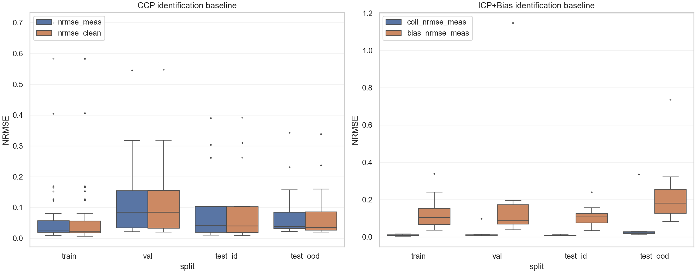
*Figure 1. 同定ベースライン誤差分布（split比較）*

意味:
- split 別に誤差分布を可視化し、汎化性能の偏りを確認する。

効果:
- ICP bias の OOD 劣化が顕著。

考察:
- ICP bias 側 OOD 強化（データ設計・モデル拡張）が最優先。特に train と test_id ではそこまで破綻していない一方、test_ood で分布全体が悪化しているため、単なる過学習というより「未学習条件に対する表現力不足」と解釈するのが妥当である。

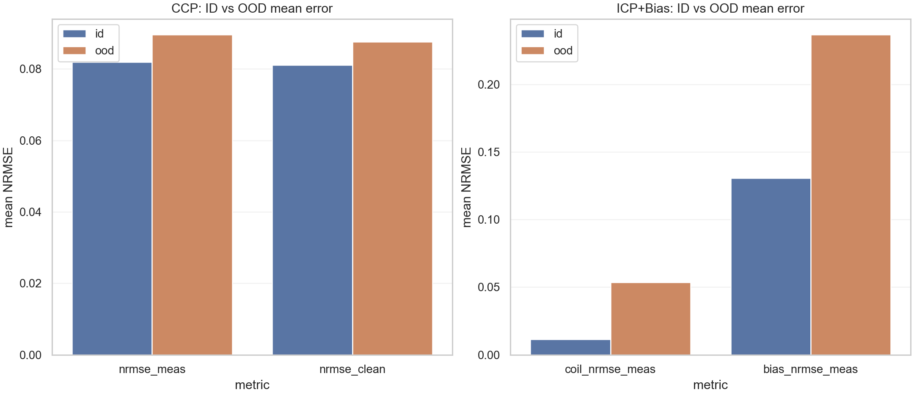
*Figure 2. ID/OOD 平均誤差ギャップ*

意味:
- OOD 劣化量を平均値で比較する。

効果:
- ICP bias が最もギャップ大。

考察:
- ICP bias は推定器の再学習だけでなく、入力特徴の再設計が必要。coil 側が比較的安定なのに対し bias 側だけが崩れることは、ポート間連成やバイアス側非線形の記述不足を示している。

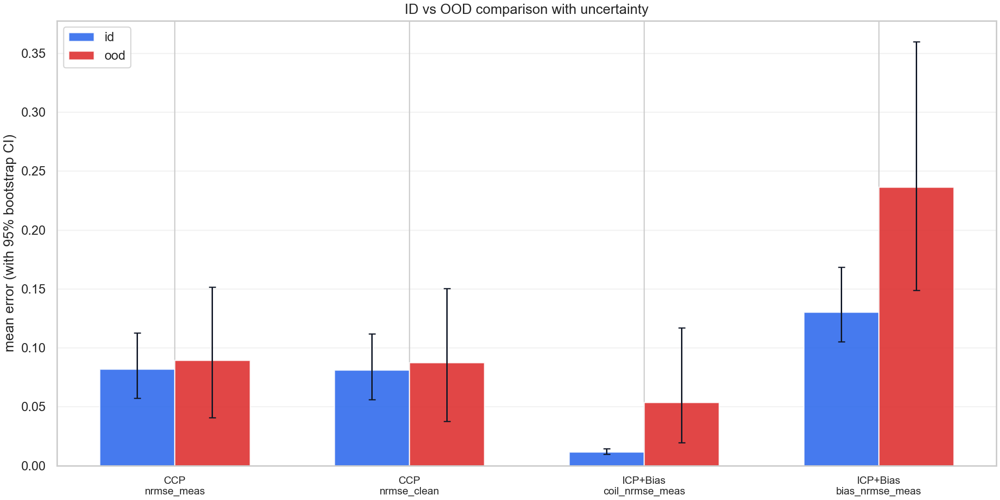
*Figure 3. ID/OOD 平均 + 95% CI*

意味:
- 不確かさ込みの差を評価する。

効果:
- ICP は OOD 方向への統計的悪化が明確。

考察:
- 実装前評価では ID 平均のみで合否を判断すべきでない。CI が広い指標は条件依存性が強く、平均値が良く見えても実運用の歩留まりが低い可能性がある。

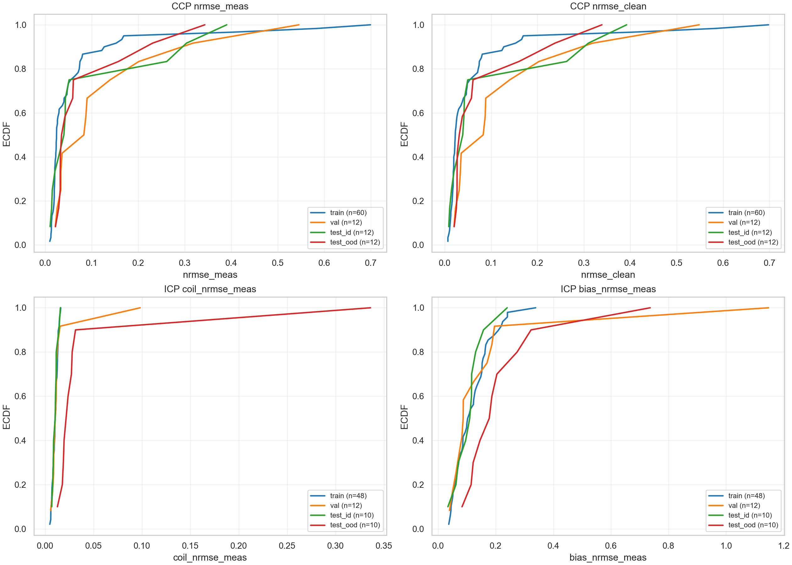
*Figure 4. 同定誤差 ECDF（split別）*

意味:
- 分布の裾（悪化ケース）を含めて評価する。

効果:
- ICP bias の右裾が太い。

考察:
- worst-case 管理の観点で、分位点目標（p90/p95）を導入すべき。実機評価では平均誤差よりも、少数の大外れケースが歩留まりや安全率を支配することが多い。

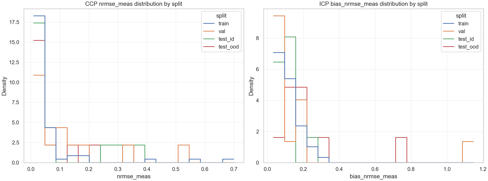
*Figure 5. split別ヒストグラム（同定誤差）*

意味:
- 分布形状差を直感的に比較する。

効果:
- CCP は val が厳しい、ICP は OOD 側で分布が右へ移動。

考察:
- split 難易度設計を目的に合わせて見直す余地が大きい。CCP で `val` が特に厳しいことは、OOD というより検証条件の構成自体が学習条件から外れている可能性を示す。

### 4.3 最適化結果（オンライン探索）

ここでの online optimizer の数値は、設計探索プロセスそのものの挙動を見るためのものである。後段の `benchmark/*_design_aggregates.csv` は別の設計集合を評価した統計であり、役割が異なる。前者は「探索がどう進んだか」、後者は「設計空間全体でどんな傾向があるか」を表す。

#### CCP 最適化

- best trial: 40 (local)
- best aggregate objective: 111.3728
- 改善率（trial1->best）: 14.10%
- random平均: 115.7269
- local平均: 112.0123

best mean metrics:
- objective 111.3375
- v_rmse 110.7722
- i_peak 145.9036 A
- avg_power 1.12e-06
- selfbias 3.38e-07 V

#### ICP+Bias 最適化

- best trial: 24 (local)
- best aggregate objective: 52.4047
- 改善率（trial1->best）: 0.0235%
- random平均: 68.6920
- local平均: 59.3242

best mean metrics:
- objective 52.4047
- v_rmse 52.3445
- i_peak 3.2800 A
- avg_power -5.31e-15
- selfbias 1.61e-15 V（target=-50Vから乖離）

注意:
- 本節の online optimizer objective 値は、`benchmark/*_design_aggregates.csv` の大規模設計集合評価とは評価集合が異なるため、絶対値の直接比較はしない。

特に ICP+Bias の best aggregate が小さく見えても、それだけで CCP より簡単な問題とは言えない。重み、目標波形、target self-bias、探索空間が異なるため、同一尺度比較ではなく「自分の問題内でどこまで改善したか」「副作用がどう出たか」で読む必要がある。

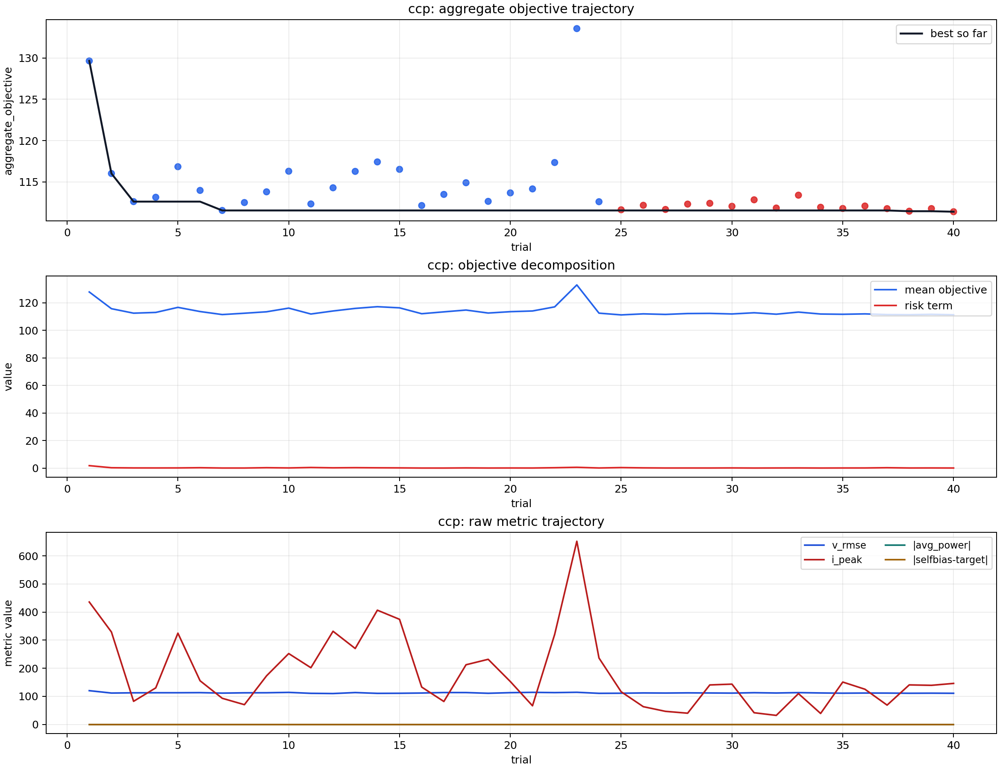
*Figure 6. CCP 最適化履歴（aggregate・分解・生指標）*

意味:
- random/local の寄与と収束挙動を可視化。

効果:
- local 探索が終盤改善を牽引。

考察:
- CCP は探索戦略の拡張余地がある。random で良い種を拾い、local で詰める現行戦略が一定の効果を持つことが確認できており、次段では局所探索の多点化や BO への拡張が現実的である。

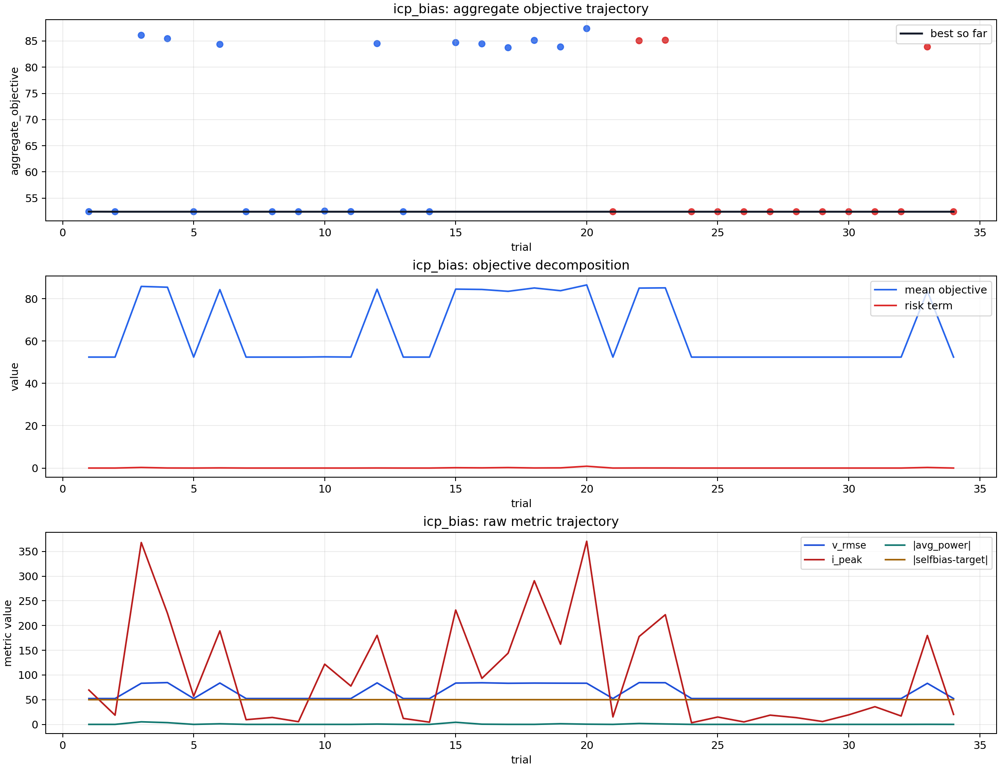
*Figure 7. ICP+Bias 最適化履歴（aggregate・分解・生指標）*

意味:
- ICP+Bias の収束性と目的競合を観察。

効果:
- 早期で飽和傾向。

考察:
- 設計空間/制約の再定義なしでは改善が頭打ち。trial 初期から best に近い値が出ていることは、探索不足ではなく「現状の評価関数で区別可能な設計が少ない」ことを意味する可能性が高い。

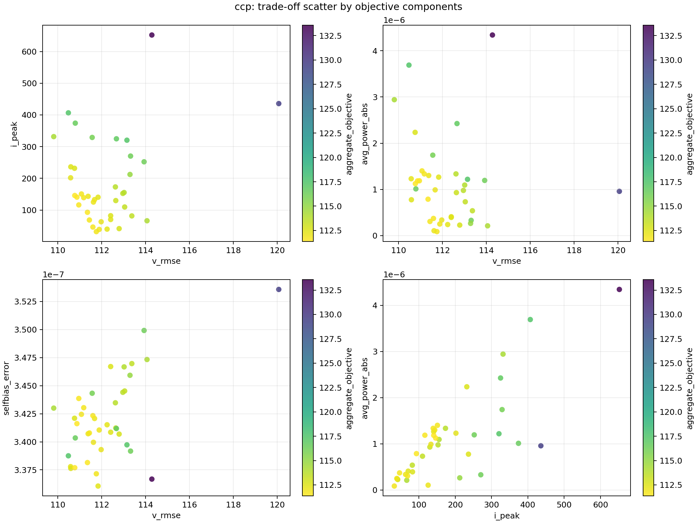
*Figure 8. CCP 指標間トレードオフ散布図*

意味:
- 指標間の競合関係を点群で把握。

効果:
- `v_rmse` 改善方向と `i_peak`/`avg_power` 悪化方向の分離が確認できる。

考察:
- ハード制約付き最適化へ移行が妥当。特に `v_rmse` を詰める方向で `i_peak` と `avg_power` が悪化するため、単純加重和だけでは危険な候補が上位に残り得る。

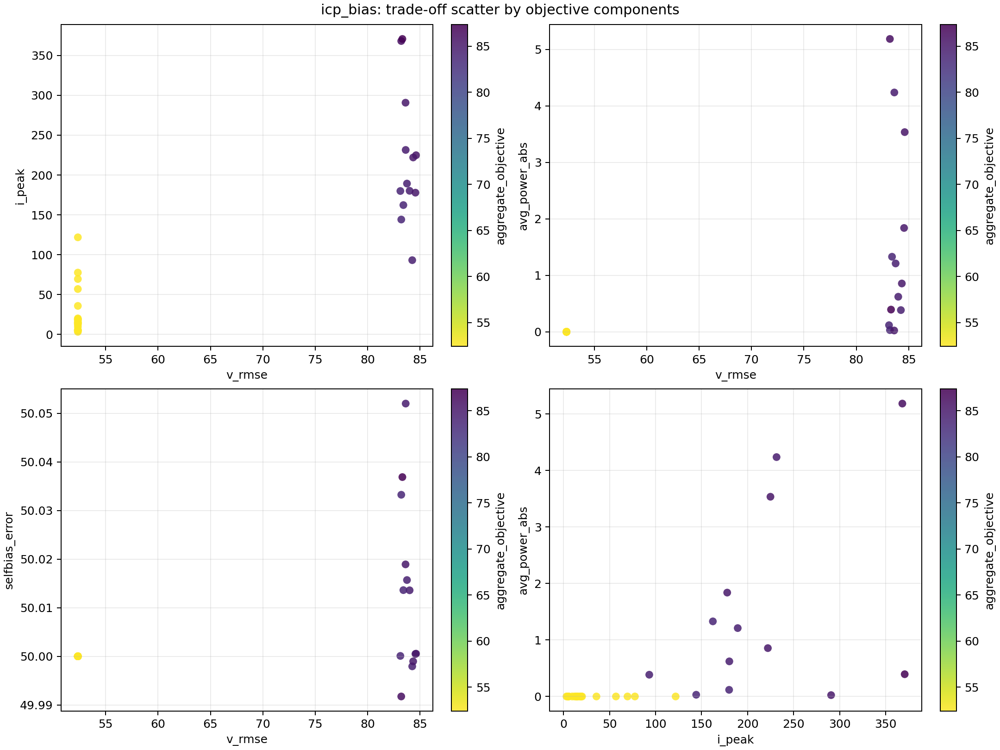
*Figure 9. ICP+Bias 指標間トレードオフ散布図*

意味:
- ICP+Bias における競合構造を可視化。

効果:
- self-bias 関連方向で急激な悪化群が存在。

考察:
- bias branch 変数の設計域調整が必要。self-bias 関連の悪化群が局所的に集中している場合、自由度不足か、逆に範囲が広すぎて非現実解を踏んでいる可能性がある。

### 4.4 ベンチマーク設計集合の統計（deep dive）

この節では、個々の最適化試行ではなく、より広い設計集合を俯瞰する。目的は「最良解を説明すること」ではなく、「なぜそのような最良解が現れたか」を設計空間全体の傾向から説明することにある。

主要統計（`deep_dive_stats.json`）:

- Pareto 前線点数: CCP 3 / ICP+Bias 6
- robust中央値: CCP 84.98 / ICP+Bias 124.25
- topology平均 robust:
- CCP: L=96.28, PI=109.47
- ICP coil: L=129.29, PI=130.11
- ICP bias: L=125.36, PI=136.89
- stability ratio median(std/mean): CCP 0.0329 / ICP 0.0148
- scenario uplift vs nominal:
- CCP: shifted +1.662, ood_nonlin +3.433
- ICP: shifted +0.507, ood_nonlin -0.331

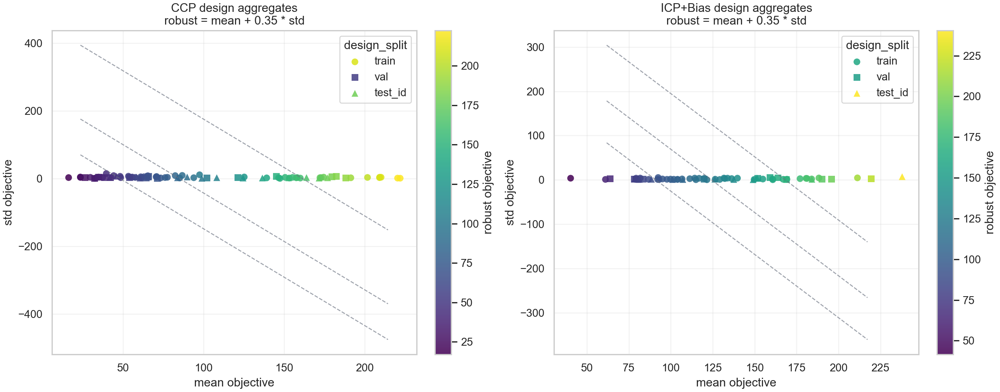
*Figure 10. robust tradeoff（mean vs std）*

意味:
- mean と std の同時最小化構造を可視化。

効果:
- CCP は分散面でのばらつきが大きい。

考察:
- CCP は設計によって再現性が大きく変動する。平均性能だけで見ると有望でも、標準偏差方向で不安定な設計が一定数存在するため、量産や条件変動を想定する場合には危険である。

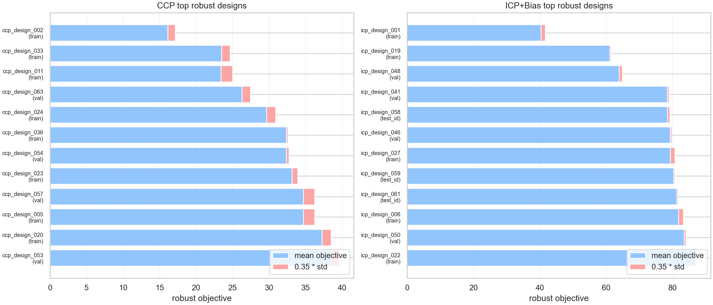
*Figure 11. 上位設計の objective 分解（mean + risk）*

意味:
- 上位解の改善源が平均改善か分散抑制かを判別。

効果:
- risk 項の影響が無視できない。

考察:
- 生産運用を見据えるとロバスト項は必須。上位候補の分解を見ると、平均性能が近くても分散項の差で順位が入れ替わり得るため、研究段階でも risk 項を省くべきではない。

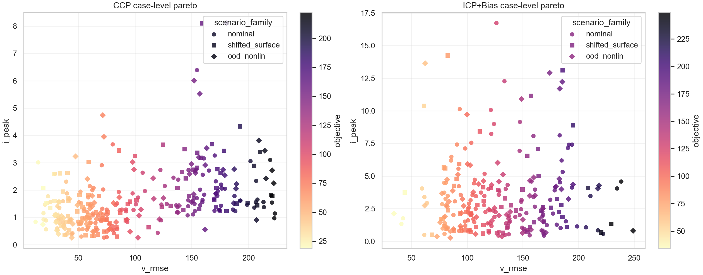
*Figure 12. case-level Pareto（v_rmse vs i_peak）*

意味:
- 波形誤差と電流ストレスの競合をケース単位で評価。

効果:
- 低誤差群に高電流ケースが混在。

考察:
- 「誤差最小=実装最適」ではない。case レベルで見ると、低 `v_rmse` 側に高 `i_peak` の点が混在しており、波形だけで選ぶと電流過大な設計を採用しかねない。

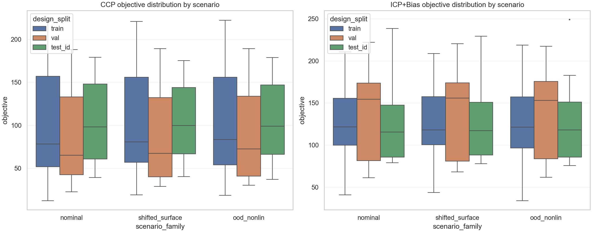
*Figure 13. scenario別 objective 分布（split重畳）*

意味:
- シナリオ依存と split依存の重なりを可視化。

効果:
- 問題ごとに難シナリオが異なる。

考察:
- シナリオ重みの問題別最適化が必要。CCP と ICP+Bias では難しい scenario が異なるため、同一のロバスト化方針を両者に機械的に適用するのは非効率である。

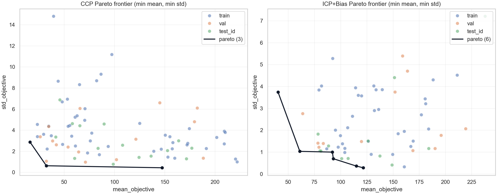
*Figure 14. design-level Pareto front（min mean/min std）*

意味:
- 非支配設計を抽出して探索難易度を把握。

効果:
- ICP の方が非支配候補が多い。

考察:
- 候補選定フェーズで追加制約が必要。Pareto 点が多いことは自由度の高さを意味するが、同時に「どれを採用するかは別の物理条件で決める必要がある」ことも意味する。

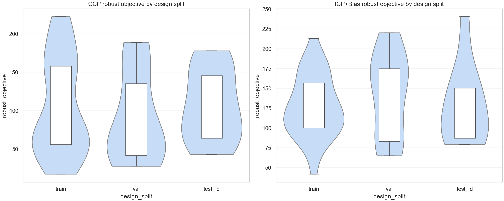
*Figure 15. split別 robust objective 分布*

意味:
- split によるロバスト分布差を評価。

効果:
- CCP は split依存差が相対的に大きい。

考察:
- 学習/検証設計が最終ランキングに影響。設計 split による分布差が大きい場合、ランキングがデータ分布に依存している可能性があるため、外部条件での再評価が不可欠になる。

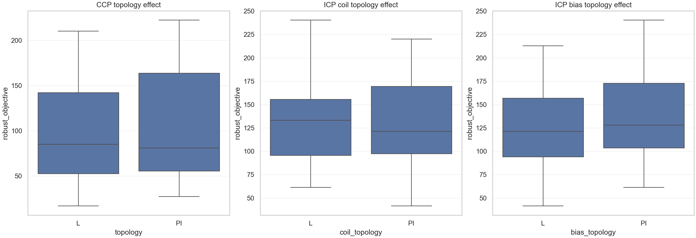
*Figure 16. トポロジ影響（L vs PI）*

意味:
- トポロジ選択と robust 指標の関係を確認。

効果:
- CCP/ICP-bias は L 優位傾向。

考察:
- PI は自由度増の反面、寄生成分で破綻しやすい。平均統計で L が優位なことは、「少ない自由度の方がロバスト」という設計実務の直感とも整合する。

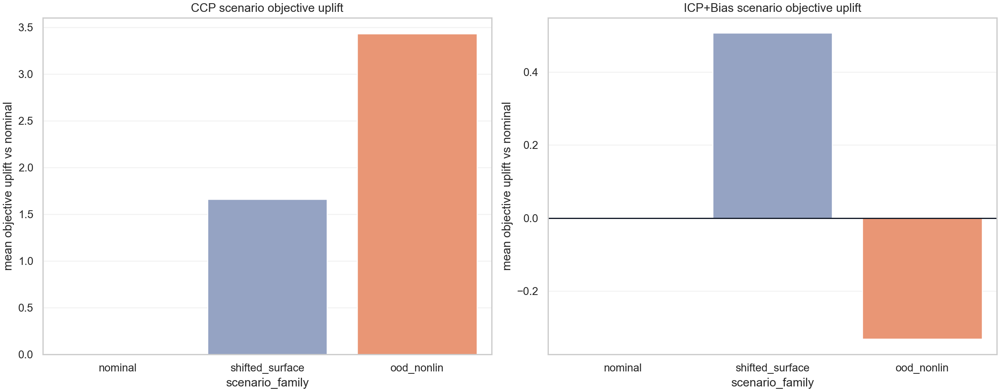
*Figure 17. scenario uplift（nominal基準）*

意味:
- どのシナリオが劣化を主導するかを定量化。

効果:
- CCP は ood_nonlin が最難。

考察:
- CCP では非線形シース変動への頑健化が鍵。`ood_nonlin` の uplift が最も大きいことは、ROM とマッチング回路の両方が非線形シース変動に十分追従できていないことを示す。

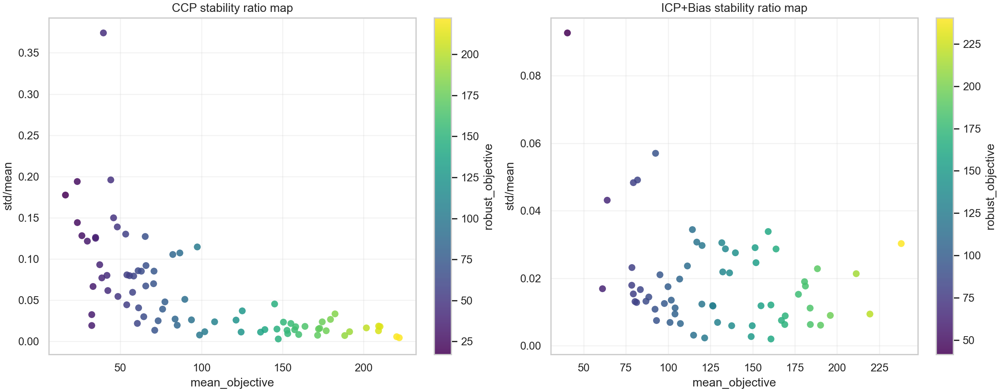
*Figure 18. stability ratio map（std/mean）*

意味:
- 高性能だが不安定な解を識別。

効果:
- ICP は相対安定、CCP はばらつき大。

考察:
- CCP は安定性制約導入で実運用性が向上。ICP は比較的安定だが、その分 self-bias 到達性のような別の制約で行き詰まっていると解釈できる。

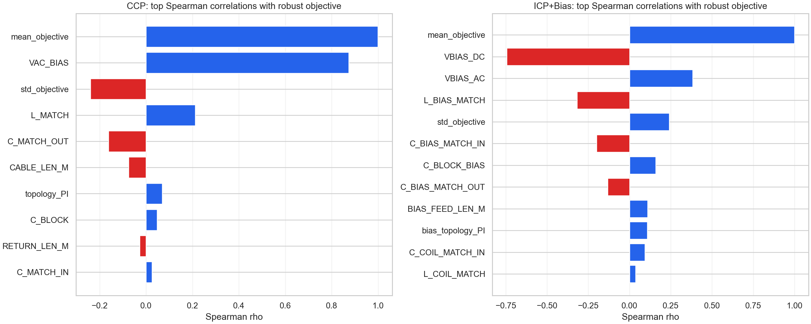
*Figure 19. 因子相関（Spearman）*

意味:
- 改善レバーになりやすい変数を特定。

効果:
- ICP で `VBIAS_DC` の寄与が大きい。

考察:
- bias DC 条件再設定が有効。相関が強い変数は、探索の感度軸でもあり、実機チューニングで優先的に調整すべきノブを示している。

### 4.5 回路図・波形の解釈

この節の図は、統計では見えにくい「実際にどの回路が、どの波形を作っているか」を示す。設計を現場に持ち込む段階では、最終的にここが最も重要になる。なぜなら、部品実装や配線設計は抽象指標ではなく、具体的な素子値と応答波形に落ちるからである。

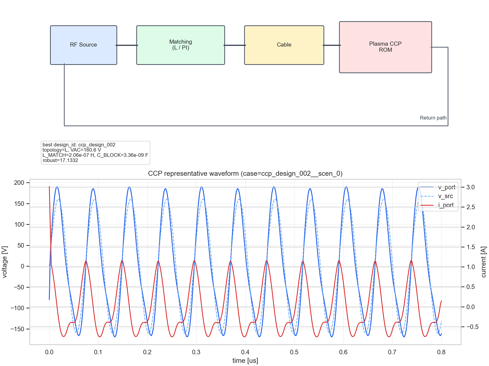
*Figure 20. CCP 代表回路と波形*

意味:
- 回路構成と応答波形を同時確認。

効果:
- 追従改善とストレス増大が同時発生し得る。

考察:
- 目標波形だけでなく電流制約の同時設定が必須。CCP では見かけ上うまく追従していても、ポート電流のピークが高い設計が残るため、実装上の安全率を別途担保しなければならない。

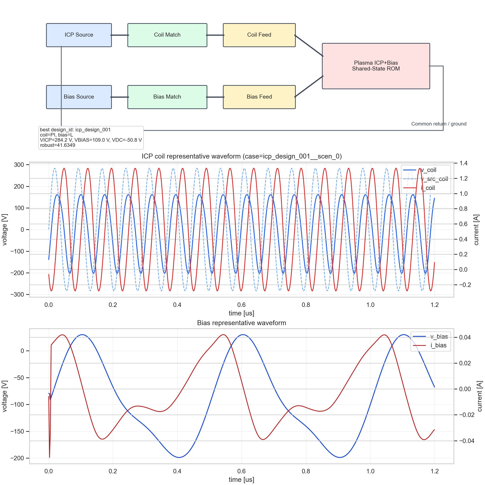
*Figure 21. ICP+Bias 代表回路と波形*

意味:
- coil/bias の連成を時系列で評価。

効果:
- bias 追従と self-bias 達成が競合。

考察:
- 二段階最適化（coarse->bias focused）が有効。まず全体整合を粗く合わせ、その後 bias branch の self-bias 調整に局所探索を集中させる方が実務的である。

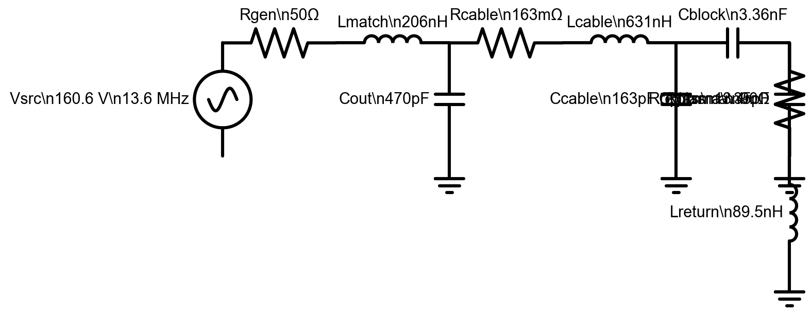
*Figure 22. CCP 最良ロバスト設計の詳細回路図*

意味:
- 素子値・寄生を実装レベルで確認。

効果:
- 配線寄生を含む設計判断が可能。

考察:
- 実機移植時の寄生同定誤差に注意。とくにケーブル長や return path のずれは、高周波では素子値変更と同等の影響を持ち得る。

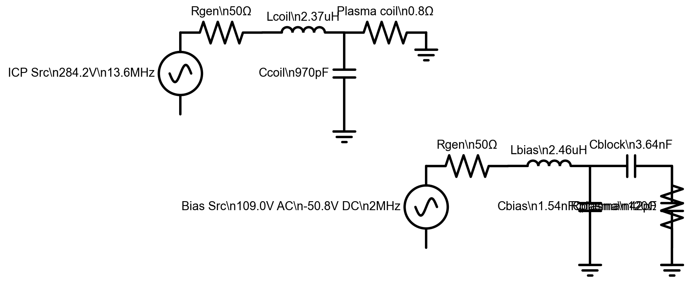
*Figure 23. ICP+Bias 最良ロバスト設計の詳細回路図*

意味:
- coil/bias branch と共有負荷を可視化。

効果:
- branch 相互干渉構造が明確。

考察:
- 片側最適化のみでは全体最適化できない。ICP+Bias は branch が分かれて見えても、最終的には共有プラズマ状態を通して相互依存している。

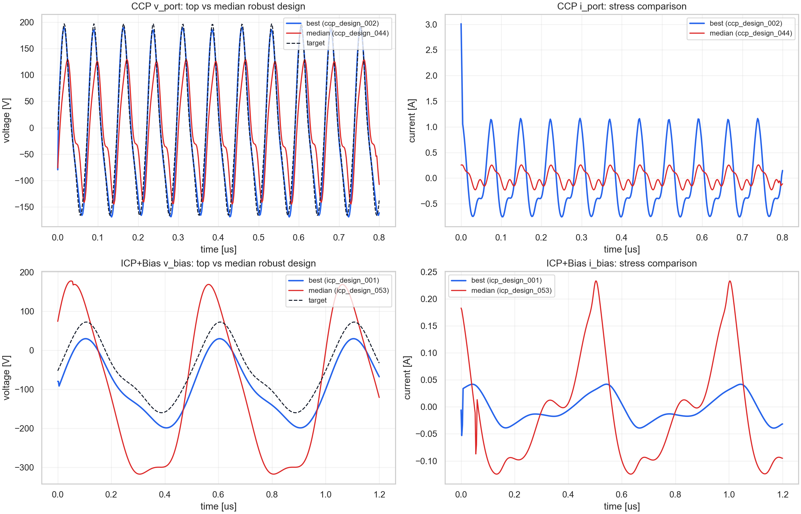
*Figure 24. 上位 vs 中央値設計の波形比較*

意味:
- 上位化の効果を中央値基準で可視化。

効果:
- target 追従は改善するが、電流応答の改善は一様でない。

考察:
- 波形追従とストレス制御の同時最適化が必要。中央値設計との差を見ると、上位化によって確かに波形は改善するが、同じ比率で電流応答が改善するわけではない。

### 4.6 RF整合評価

ここでは時間波形から基本波フェーザを抽出し、複素インピーダンスと反射係数に変換して RF 的な整合状態を確認している。回路最適化が波形指標だけで終わると、実際の電源効率や反射電力の問題を見逃すため、この節は実装可能性の観点で重要である。

主要値（`deep_dive_stats.json`）:

- CCP: `|Gamma| mean = 0.9965`, `RL mean = 0.031 dB`
- ICP bias: `|Gamma| mean = 0.9858`, `RL mean = 0.139 dB`

scenario別 RL 平均:
- CCP: nominal 0.030, shifted 0.029, ood_nonlin 0.035
- ICP: nominal 0.131, shifted 0.156, ood_nonlin 0.140

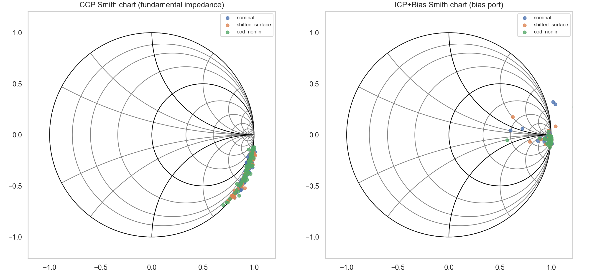
*Figure 25. Smith chart（CCP / ICP bias port）*

意味:
- 反射係数分布で整合状態を評価。

効果:
- 点群は外周近傍で整合不良。

考察:
- RL/VSWR 制約なしでは実機効率改善は難しい。Smith chart 上で外周近傍に点が多いことは、入力電力の大部分が反射される側に寄っていることを意味する。

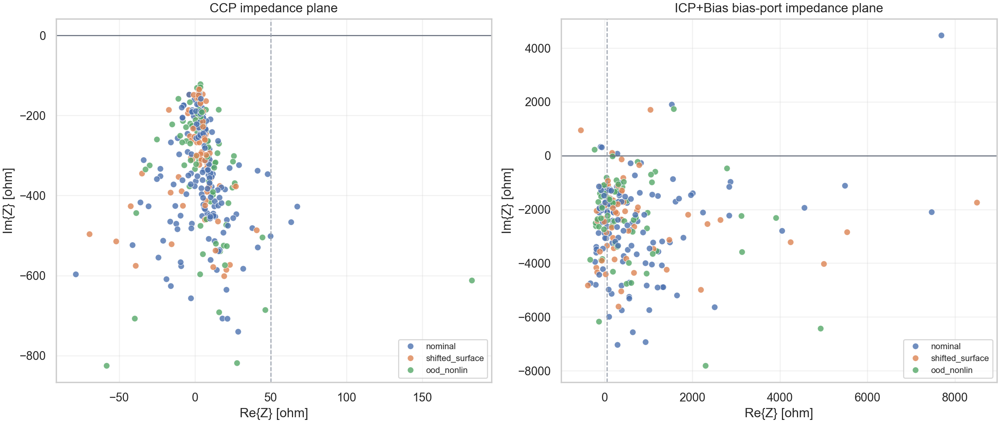
*Figure 26. 複素インピーダンス平面（Re/Im）*

意味:
- シナリオごとの負荷変動を実部/虚部で把握。

効果:
- シナリオで分布中心が移動。

考察:
- 固定マッチングのみでの全条件最適は困難。インピーダンス中心が scenario ごとに移動する以上、一つの固定点に整合させても他条件では外れる。

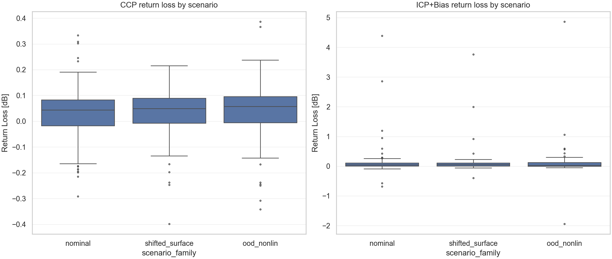
*Figure 27. scenario別 Return Loss 分布*

意味:
- 反射損失のシナリオ依存を比較。

効果:
- 平均 RL が全体に低い。

考察:
- 次フェーズで RF拘束追加が必要。現状の RL は「評価しているが最適化していない」状態なので、今後は objective または constraint として直接取り込むべきである。

### 4.7 指標別最適化（副作用評価）

この節は、設計会議で最も実用的な情報を与える。なぜなら「どの指標を優先すると、他がどれだけ壊れるか」が見えるためである。単一指標の最良値だけでは、実際に採用してよい設計かどうか判断できない。

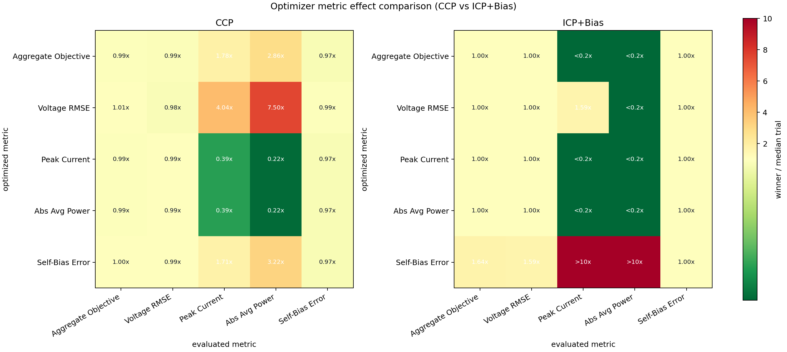
*Figure 28. 指標別最適化の副作用比較（CCP vs ICP+Bias）*

意味:
- 最適化指標ごとの他指標への波及を比較。

効果:
- CCP は `i_peak` 系が比較的バランス良好。
- ICP は `selfbias_error` 単独最適化で副作用大。

考察:
- ICP は制約付き多目的最適化へ移行が必須。特に self-bias を単独で詰めると aggregate や電流が悪化するため、重み付き和だけでは設計意図を十分表せない。

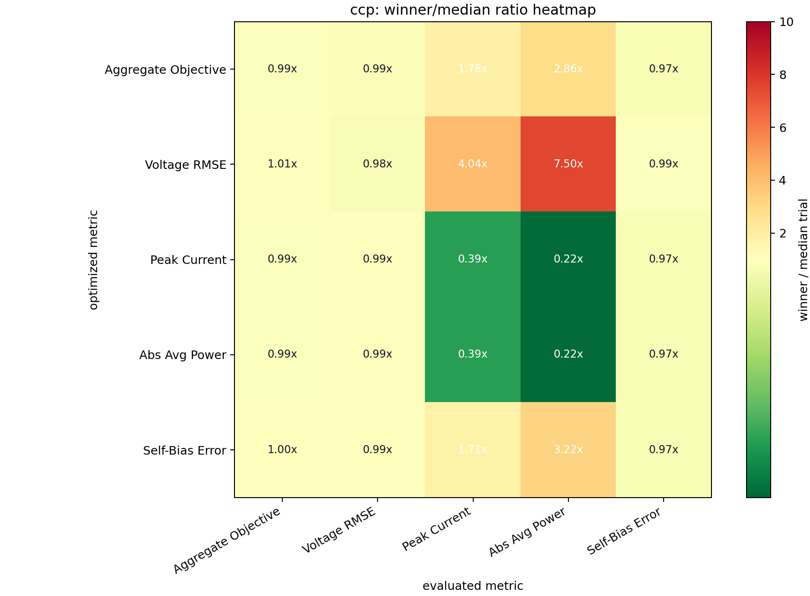
*Figure 29. CCP 指標別 ratio heatmap*

意味:
- CCP 内での指標競合構造を詳細化。

効果:
- `v_rmse` 最適化は `i_peak`/`avg_power_abs` 悪化。

考察:
- 波形重視設計に電流制約を必ず併用。CCP の heatmap は、`v_rmse` 方向の改善がそのまま良設計を意味しないことをはっきり示している。

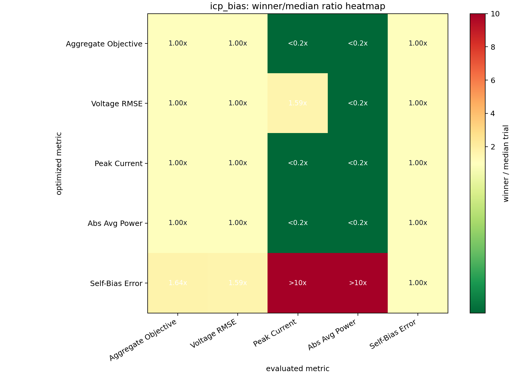
*Figure 30. ICP+Bias 指標別 ratio heatmap*

意味:
- ICP 内での指標競合構造を詳細化。

効果:
- `aggregate` と `i_peak` が同一 trial に収束。

考察:
- 現在の重みでは self-bias 達成が後順位化。aggregate と i_peak の最良 trial が一致することは、探索器が「安全かつ低誤差」な設計を優先し、self-bias を十分重く見ていないことを示す。

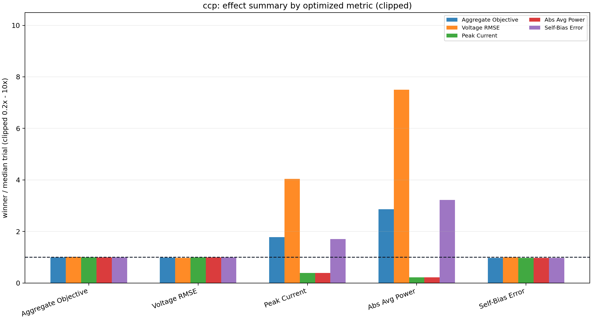
*Figure 31. CCP 効果サマリ（winner/median）*

意味:
- 最適化方針ごとの総合効果を俯瞰。

効果:
- `i_peak`/`avg_power_abs` 最適化の総合優位性が確認できる。

考察:
- 実装上は電流・熱設計に整合する。CCP では `i_peak`/`avg_power_abs` 最適化が総合悪化をほとんど伴わないため、現場で採用しやすい方針である。

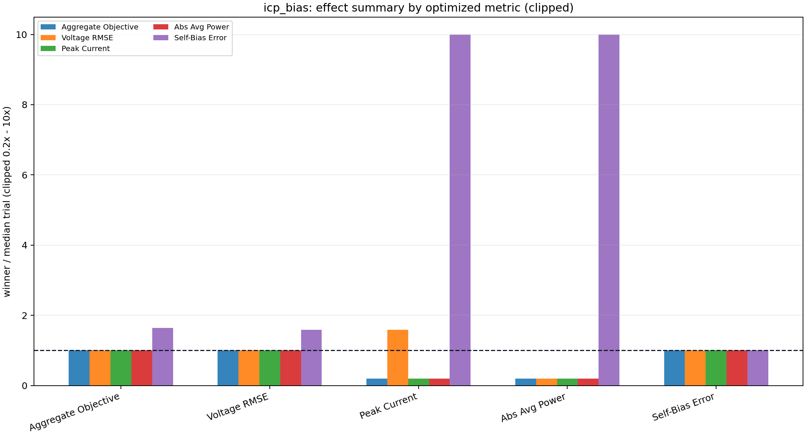
*Figure 32. ICP+Bias 効果サマリ（winner/median）*

意味:
- ICP の最適化戦略ごとの副作用を比較。

効果:
- `selfbias_error` 最適化は他指標悪化を伴う。

考察:
- self-bias は制約化し、単独最適化を避けるべき。ICP の効果サマリは、self-bias を下げること自体は可能でも、それを実用範囲の副作用で達成できていないことを示す。

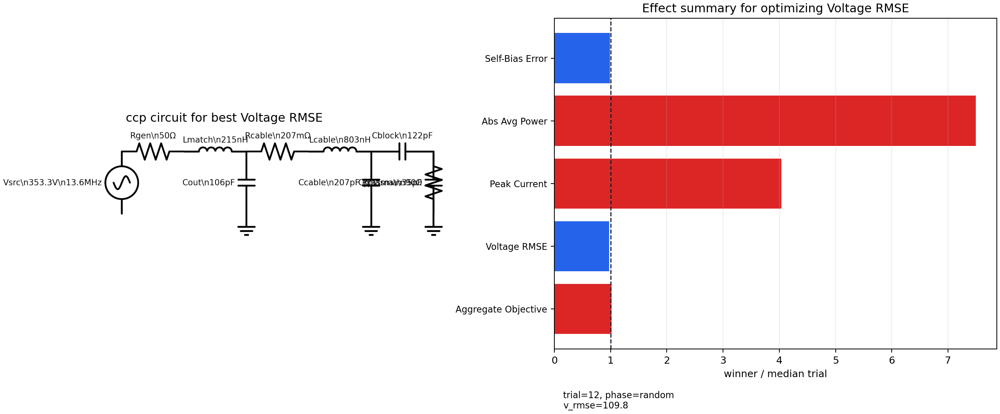
*Figure 33. CCP: v_rmse最良回路と副作用ストーリー*

意味:
- 指標最良回路と副作用を同時解釈。

効果:
- v_rmse 改善時の電流/電力悪化を視覚確認できる。

考察:
- 指標単独最適の採用判断に有効。単に heatmap で比率を見るより、実際の回路図付きで見ることで「なぜその副作用が出たか」を設計変数レベルで考えられる。

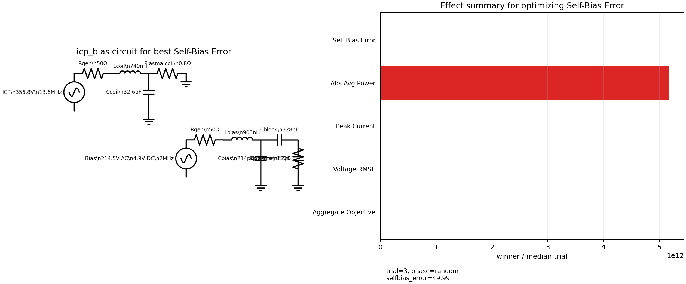
*Figure 34. ICP+Bias: selfbias_error最良回路と副作用ストーリー*

意味:
- selfbias優先時の全体影響を可視化。

効果:
- aggregate, i_peak, avg_power の悪化が明確。

考察:
- self-bias は単独最適化ではなく制約条件で扱うのが妥当。これは数値結果だけでなく、ストーリー図から見える回路構成の偏りとも整合する。

---

## 5. 総合考察（専門家視点）

### 5.1 低圧プラズマ専門家視点

- ICP bias の OOD 劣化は、壁面状態・非線形容量・時定数変動の表現不足を示唆。  
- CCP の `ood_nonlin` 劣化は、シース非線形が支配課題であることを示す。  
- シナリオ間で最適条件が移動するため、単一固定整合では限界がある。

要するに、現状モデルは「平均的な条件ではそれなりに説明できるが、条件外挿に弱い」。これは研究用 surrogate としては妥当な初期段階だが、プロセス設計に直接使うには不十分である。とくに ICP bias は、自己バイアスとポート波形の両方を同時に説明できるモデルへ引き上げる必要がある。

### 5.2 回路設計者視点

- 波形追従最適化だけではピーク電流/電力が悪化しやすい。  
- PI は自由度が高いが、寄生成分込みで設計マージンを失いやすい。  
- RF整合を目的関数に入れないと、実機電源効率改善へ繋がらない。

回路設計の観点では、本結果はかなり素直である。自由度を増やした設計は一見有利に見えるが、寄生と条件変動を含めると不安定になりやすい。したがって、まず安全側の L 系構成や電流制約で解の範囲を絞り、その後必要に応じて自由度を増やす方が設計フローとして健全である。

### 5.3 実務結論

- 現ベンチマークは比較基盤として有効。  
- 実機適用には「同定OOD強化 + self-bias制約化 + RF拘束追加」を同時実施する必要がある。

重要なのは、これら三つが代替関係ではなく補完関係にある点である。同定だけ強くしても RF整合を見なければ実装効率が出ず、RF拘束だけ足しても self-bias が外れればプロセス条件を満たせない。したがって、次の改善は一括で設計する必要がある。

---

## 6. 優先改善ロードマップ

1. **目的関数再設計（最優先）**
- self-bias をソフト項から制約へ移行（`|selfbias-target| <= tol`）
- RF拘束（`|Gamma|`, `RL`, `VSWR`）追加

2. **ICP+Bias 設計空間の再定義**
- `VBIAS_DC`, `L_BIAS_MATCH`, `C_BIAS_MATCH_*` 範囲再較正
- bias branch 専用の第2段局所探索を導入

3. **同定モデル強化**
- OOD条件拡張、連成特徴量追加、モデル容量増強

4. **探索アルゴリズム高度化**
- random+local から多目的 BO（Optuna/BoTorch）へ移行

5. **高忠実度検証ループ**
- 上位候補を PIC/Fluid/COMSOL で再評価し順位整合を確認

この優先順位は、実装効果の大きさで並べている。最初に objective/constraint を直す理由は、探索器の賢さよりも「何を良しとするか」の定義の方が最終結果を支配するからである。現状の結果は、探索手法より先に問題定義を磨くべき段階にある。

---

## 7. 再現手順と参照ファイル

### 7.1 再実行

```bash
./.venv/bin/python scripts/run_benchmark_full.py --python ./.venv/bin/python --ngspice ngspice
./.venv/bin/python scripts/plot_optimizer_metric_story.py --repo-root . --ccp-workdir results/ccp_run --icp-workdir results/icp_bias_run --outdir results/optimizer_story
```

### 7.2 参照ファイル

- `benchmark/manifest.json`
- `benchmark/baselines/baseline_summary.json`
- `results/ccp_run/history.json`
- `results/ccp_run/best_result.json`
- `results/icp_bias_run/history.json`
- `results/icp_bias_run/best_result.json`
- `results/benchmark_figures/deep_dive_stats.json`
- `results/benchmark_figures/deep_id_ood_ci_table.csv`
- `results/optimizer_story/ccp/optimizer_metric_winners_ccp.csv`
- `results/optimizer_story/icp_bias/optimizer_metric_winners_icp_bias.csv`
- `report_assets/latest/`
- `repot.md`
- `fig_readme.md`

---

本レポートは `repot.md` の章立て・定量説明を基盤に、`report.md` の図解とキャプションを統合した最新版である。再実行時は `report_assets/latest` を上書きするだけで本文参照を維持できる。
